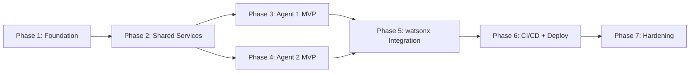

# Petragentic — Solution Architecture Plan

## Top-Level Overview

**Goal:** Build a production-ready, greenfield IBM Cloud solution containing two AI-powered agents:

| Agent | Purpose |
|---|---|
| **Agent 1 — Integration Design & Automation** | Accept natural-language integration requirements and produce end-to-end design documents with tool, protocol, format, and auth recommendations. Approved-tool catalogue is **learnable** — usage is recorded in watsonx.data and updates the catalogue weighting over time. |
| **Agent 2 — Security Compliance & Audit** | Validate Windows server security baselines via WinRM/PowerShell, detect drift, generate remediation scripts, and produce compliance reports aligned to **CIS Benchmark** and **NIST 800-53** control families. |

**Runtime:** Python (FastAPI) containerised services deployed to **IBM Code Engine** (serverless).
**CI/CD:** GitHub Actions — push model with PR gates, push-to-main deployment, and scheduled audit scans.
**AI Platform:** watsonx.ai (LLM inference), watsonx.data (audit & design artefact storage + learnable catalogue), watsonx.governance (model lifecycle, bias, drift, audit trail).
**Deployment Scope:** Single region — `us-south` (Dallas). DR capability can be added later.

## Confirmed Design Decisions

| # | Decision | Resolution |
|---|---|---|
| 1 | Compliance report regulatory framework | **CIS Benchmark** controls + **NIST 800-53** control family mapping on every report |
| 2 | Agent 1 approved-tool catalogue | **Learnable** — every design generation writes usage back to `integration_catalogue` in watsonx.data; recommendation engine uses historical frequency to rank approved tools |
| 3 | Terraform region scope | **us-south only** — single region, DR deferred |

---

## High-Level Architecture

```
┌─────────────────────────────────────────────────────────────┐
│                        GitHub Repository                     │
│  ┌──────────────┐  ┌──────────────┐  ┌─────────────────┐   │
│  │  agent1/     │  │  agent2/     │  │  .github/        │   │
│  │  (FastAPI)   │  │  (FastAPI)   │  │  workflows/      │   │
│  └──────┬───────┘  └──────┬───────┘  └────────┬────────┘   │
└─────────┼────────────────┼──────────────────────┼───────────┘
          │   PR / push / schedule                │
          ▼                ▼                      ▼
┌─────────────────────── GitHub Actions ─────────────────────┐
│  pr-gate.yml   deploy-agent1.yml   deploy-agent2.yml        │
│  audit-scan.yml (scheduled cron)                            │
└──────────────────────────────────────────────────────────── ┘
          │                │
          ▼                ▼
┌──────── IBM Code Engine (us-south region) ─────────────────┐
│  ┌─────────────────────┐   ┌───────────────────────────┐   │
│  │  agent1-api         │   │  agent2-api               │   │
│  │  (FastAPI container)│   │  (FastAPI container)      │   │
│  └────────┬────────────┘   └──────────┬────────────────┘   │
└───────────┼──────────────────────────┼────────────────────┘
            │                          │
            ▼                          ▼
┌────────────────── IBM watsonx Platform ────────────────────┐
│                                                             │
│  ┌──────────────────────────────────────────────────────┐  │
│  │  watsonx.ai (granite-13b-chat / granite-34b-code)    │  │
│  │  • Agent 1: NL → design doc generation               │  │
│  │  • Agent 2: drift analysis, remediation generation   │  │
│  └──────────────────────────────────────────────────────┘  │
│                                                             │
│  ┌──────────────────────────────────────────────────────┐  │
│  │  watsonx.data (Presto + Iceberg on IBM COS)          │  │
│  │  • Agent 1: design artefact catalogue                │  │
│  │  • Agent 2: baseline snapshots, audit history        │  │
│  └──────────────────────────────────────────────────────┘  │
│                                                             │
│  ┌──────────────────────────────────────────────────────┐  │
│  │  watsonx.governance (OpenScale / AI Factsheets)      │  │
│  │  • Model lifecycle tracking for both agents          │  │
│  │  • Prompt audit trail                                │  │
│  │  • Compliance report metadata                        │  │
│  └──────────────────────────────────────────────────────┘  │
└─────────────────────────────────────────────────────────────┘
            │                          │
            │                ┌─────────▼─────────────┐
            │                │  IBM Cloud VPN /       │
            │                │  Direct Link           │
            │                └─────────┬─────────────┘
            │                          │ WinRM / PSRemoting
            │                          ▼
            │                ┌─────────────────────┐
            │                │  Windows Servers     │
            │                │  (on-prem / VPC)     │
            │                └─────────────────────┘
            │
     ┌──────▼──────────────────────────────────────────┐
     │  IBM Cloud Object Storage (COS)                  │
     │  • Design documents (Agent 1 output)             │
     │  • Compliance reports + PS scripts (Agent 2)     │
     │  • watsonx.data Iceberg tables                   │
     └─────────────────────────────────────────────────┘
```

---

## Component Responsibilities

### Agent 1 — Integration Design & Automation API

| Component | Responsibility |
|---|---|
| `POST /design` FastAPI endpoint | Accept NL integration requirement; orchestrate LLM call chain |
| Tool recommendation engine | Rule-based pre-filter (approved tools: IBM Redwood, webMethods, Apache NiFi, Azure Logic Apps) fed into LLM prompt |
| LLM chain (watsonx.ai) | Generate protocol, data format, auth recommendation, and full design document |
| Design artefact writer | Persist generated document to IBM COS; register metadata in watsonx.data catalogue |
| watsonx.governance logger | Log prompt, model ID, parameters, and output to AI Factsheets for audit |

### Agent 2 — Security Compliance & Audit API

| Component | Responsibility |
|---|---|
| `POST /validate` FastAPI endpoint | Accept target server list + validation scope; trigger WinRM collection |
| WinRM collector module | Connect to Windows servers via PowerShell Remoting; gather folders, permissions, shares, local groups, group memberships, service accounts |
| Baseline comparator | Compare collected state against stored baseline snapshot in watsonx.data |
| Drift detector | Identify deviations; classify severity |
| Remediation generator (watsonx.ai) | Generate natural-language remediation actions and PowerShell remediation scripts |
| Compliance report writer | Produce structured report (JSON + HTML); push to IBM COS |
| watsonx.governance logger | Log audit scan metadata, model usage, and report provenance |

### GitHub Actions Workflows

| Workflow file | Trigger | Purpose |
|---|---|---|
| `pr-gate.yml` | `pull_request` to main | Lint, unit tests, container build (no push) |
| `deploy-agent1.yml` | `push` to main (path: `agent1/**`) | Build + push image to IBM Container Registry; deploy to Code Engine |
| `deploy-agent2.yml` | `push` to main (path: `agent2/**`) | Build + push image to IBM Container Registry; deploy to Code Engine |
| `audit-scan.yml` | `schedule` (cron) + `workflow_dispatch` | Trigger Agent 2 `/validate` endpoint for periodic compliance scans |

### IBM Cloud Services

| Service | Role |
|---|---|
| **IBM Code Engine** | Serverless container runtime for both agents; auto-scales to zero |
| **IBM Container Registry** | Private OCI image registry; images built by GitHub Actions |
| **IBM Cloud Object Storage** | Durable storage for design docs, compliance reports, PowerShell scripts, Iceberg data files |
| **IBM Secrets Manager** | Store WinRM credentials, watsonx API keys, COS HMAC keys — injected as Code Engine secrets |
| **IBM Cloud VPN Gateway / Direct Link** | Private connectivity from Code Engine to on-prem Windows servers |
| **IBM Cloud IAM** | Service IDs and API keys for GitHub Actions → IBM Cloud authentication |

---

## watsonx Platform Mapping

### watsonx.ai
- **Used by:** Both agents
- **Models:** `ibm/granite-13b-chat-v2` for design/remediation narrative; `ibm/granite-34b-code-instruct-v1` for PowerShell script generation
- **Rationale:** Granite models are enterprise-licensed, data-not-retained, and auditable via watsonx.governance. No third-party LLM data egress.

### watsonx.data
- **Used by:** Both agents
- **Schema:**
  - `integration_catalogue` — design artefact metadata (agent, timestamp, tool chosen, protocol, auth, COS object key)
  - `server_baselines` — approved baseline snapshots per server class
  - `audit_scans` — scan results per server per run (Iceberg partitioned by date)
  - `drift_findings` — deviation records with severity and remediation status
- **Rationale:** Iceberg tables on COS give time-travel querying for historical comparisons and compliance evidence without a managed RDBMS.

### watsonx.governance
- **Used by:** Both agents
- **Features used:**
  - AI Factsheets — track model ID, version, prompt template version, and output for every inference call
  - Model risk evaluation — periodic evaluation of Agent 1 recommendation quality
  - Audit trail — immutable record of every compliance scan trigger, model call, and report generation
- **Rationale:** Satisfies enterprise AI governance requirements; provides regulator-ready evidence of model behaviour without custom logging infrastructure.

---

## IBM Cloud Deployment Model

```
Region: us-south (Dallas)
├── Resource Group: petragentic-prod
│   ├── Code Engine Project: petragentic-ce
│   │   ├── Application: agent1-api  (min=0, max=10, cpu=1, mem=4G)
│   │   └── Application: agent2-api  (min=0, max=10, cpu=2, mem=8G)
│   ├── Container Registry Namespace: petragentic
│   ├── Object Storage Instance: petragentic-cos
│   │   ├── Bucket: petragentic-artefacts   (design docs, reports, scripts)
│   │   └── Bucket: petragentic-data        (Iceberg data files for watsonx.data)
│   ├── Secrets Manager Instance: petragentic-sm
│   ├── watsonx.ai Project: petragentic-ai
│   ├── watsonx.data Instance: petragentic-wxdata
│   ├── watsonx.governance Instance: petragentic-wxgov
│   └── VPN Gateway: petragentic-vpn  (connected to on-prem Windows network)
```

---

## Repository Structure

### Mono-repo vs Multi-repo Decision

**Decision: Monorepo** — single GitHub repository named `petragentic`.

| Factor | Monorepo verdict |
|---|---|
| Two services share a `shared/` Python library | ✅ Monorepo eliminates package publishing overhead |
| GitHub Actions workflows cross-reference both services | ✅ Single workflow directory; path filters isolate deploys |
| Small team, single product | ✅ One PR, one review, one merge for cross-cutting changes |
| Services deploy independently to Code Engine | ✅ Path-filtered workflows (`agent1/**`, `agent2/**`) still give independent deploy pipelines |
| Future multi-repo migration | ✅ Clean service boundaries today make extraction trivial later |

> Multi-repo is only warranted when teams, release cadences, or security boundaries diverge significantly. They do not here.

---

### Full Repository Tree

```
petragentic/
│
├── .github/
│   ├── workflows/
│   │   ├── pr-gate.yml                  # PR: lint + unit tests (both services)
│   │   ├── deploy-agent1.yml            # push main, path agent1/**: build → ICR → Code Engine
│   │   ├── deploy-agent2.yml            # push main, path agent2/**: build → ICR → Code Engine
│   │   ├── deploy-gateway.yml           # push main, path gateway/**: build → ICR → Code Engine
│   │   ├── deploy-frontend.yml          # push main, path frontend/**: build → ICR → Code Engine
│   │   └── audit-scan.yml              # schedule cron + workflow_dispatch → POST /validate
│   └── pull_request_template.md
│
├── agent1/                              # Integration Design & Automation service
│   ├── app/
│   │   ├── __init__.py
│   │   ├── main.py                      # FastAPI app; routes: /design /catalogue/stats /health
│   │   ├── routes/
│   │   │   ├── design.py                # POST /design endpoint handler
│   │   │   └── catalogue.py             # GET /catalogue/stats endpoint handler
│   │   ├── services/
│   │   │   ├── recommender.py           # Approved-tool list + usage-frequency ranking
│   │   │   ├── prompt_builder.py        # Structured prompt construction
│   │   │   ├── design_generator.py      # Granite-13b-chat inference call + response parser
│   │   │   └── catalogue_store.py       # watsonx.data INSERT/UPDATE integration_catalogue
│   │   ├── models/
│   │   │   ├── request.py               # Pydantic: DesignRequest
│   │   │   └── response.py              # Pydantic: DesignResponse, CatalogueStats
│   │   └── config.py                    # Settings via pydantic-settings / env vars
│   ├── tests/
│   │   ├── unit/
│   │   │   ├── test_recommender.py
│   │   │   ├── test_prompt_builder.py
│   │   │   └── test_design_generator.py
│   │   └── integration/
│   │       └── test_design_api.py
│   ├── Dockerfile
│   ├── requirements.txt
│   └── .env.example
│
├── agent2/                              # Security Compliance & Audit service
│   ├── app/
│   │   ├── __init__.py
│   │   ├── main.py                      # FastAPI app; routes: /validate /report/{id} /health
│   │   ├── routes/
│   │   │   ├── validate.py              # POST /validate endpoint handler
│   │   │   └── report.py               # GET /report/{scan_id} endpoint handler
│   │   ├── services/
│   │   │   ├── winrm_collector.py       # WinRM/PSRemoting collector → structured JSON
│   │   │   ├── baseline_comparator.py   # Fetch baseline from watsonx.data; diff
│   │   │   ├── drift_detector.py        # Severity classification + CIS/NIST mapping
│   │   │   ├── remediation_generator.py # Granite-34b-code → PS1 script per finding
│   │   │   ├── report_writer.py         # Jinja2 HTML + JSON report; upload to COS
│   │   │   └── audit_store.py          # watsonx.data INSERT audit_scans + drift_findings
│   │   ├── models/
│   │   │   ├── request.py               # Pydantic: ValidateRequest
│   │   │   └── response.py              # Pydantic: ScanReport, DriftFinding, RemediationScript
│   │   ├── data/
│   │   │   └── controls_mapping.json    # CIS control ID + NIST 800-53 family per finding category
│   │   ├── templates/
│   │   │   └── compliance_report.html.j2 # Jinja2 HTML report template
│   │   └── config.py                    # Settings via pydantic-settings / env vars
│   ├── tests/
│   │   ├── unit/
│   │   │   ├── test_winrm_collector.py
│   │   │   ├── test_drift_detector.py
│   │   │   └── test_remediation_generator.py
│   │   └── integration/
│   │       └── test_validate_api.py
│   ├── Dockerfile
│   ├── requirements.txt
│   └── .env.example
│
├── gateway/                             # API Gateway service (request routing + auth)
│   ├── app/
│   │   ├── __init__.py
│   │   ├── main.py                      # FastAPI app; reverse-proxies to agent1 + agent2
│   │   ├── routes/
│   │   │   ├── proxy_agent1.py          # Forward /api/v1/design/** → agent1-api
│   │   │   └── proxy_agent2.py          # Forward /api/v1/compliance/** → agent2-api
│   │   ├── middleware/
│   │   │   ├── auth.py                  # IBM App ID / API key validation
│   │   │   └── rate_limit.py            # Simple token-bucket rate limiter
│   │   └── config.py
│   ├── tests/
│   │   └── test_gateway_routes.py
│   ├── Dockerfile
│   ├── requirements.txt
│   └── .env.example
│
├── frontend/                            # Simple UI (React or plain HTML/JS)
│   ├── public/
│   │   └── index.html
│   ├── src/
│   │   ├── components/
│   │   │   ├── DesignForm.jsx           # Agent 1 — submit NL requirement
│   │   │   ├── DesignResult.jsx         # Rendered design document viewer
│   │   │   ├── ComplianceDashboard.jsx  # Agent 2 — trigger scan + view reports
│   │   │   └── ReportViewer.jsx         # Embedded HTML report display
│   │   ├── services/
│   │   │   └── api.js                   # Axios client → gateway /api/v1/**
│   │   └── App.jsx
│   ├── Dockerfile
│   ├── package.json
│   └── .env.example
│
├── shared/                              # Shared Python library (imported by agent1 + agent2)
│   ├── __init__.py
│   ├── watsonx_client.py                # ibm_watsonx_ai ModelInference factory
│   ├── cos_client.py                    # IBM COS ibm_boto3 resource; upload/download helpers
│   ├── governance_logger.py             # AI Factsheets REST API logger
│   ├── secrets.py                       # IBM Secrets Manager fetch-at-startup helper
│   ├── wxdata_client.py                 # watsonx.data Presto REST query/insert helper
│   └── tests/
│       ├── test_watsonx_client.py
│       ├── test_cos_client.py
│       └── test_wxdata_client.py
│
├── infra/
│   ├── terraform/
│   │   ├── main.tf                      # IBM Cloud provider, resource group
│   │   ├── code_engine.tf               # CE project + 4 applications (agent1, agent2, gateway, frontend)
│   │   ├── cos.tf                       # COS instance + petragentic-artefacts + petragentic-data buckets
│   │   ├── secrets.tf                   # Secrets Manager instance + secret group
│   │   ├── iam.tf                       # Service IDs + least-privilege IAM policies
│   │   ├── vpn.tf                       # VPN Gateway + on-prem connection
│   │   ├── variables.tf
│   │   └── outputs.tf
│   ├── docker-compose.yml               # Local dev: all 4 services + mock watsonx stubs
│   └── README.md                        # terraform init/plan/apply instructions
│
├── docs/
│   ├── architecture.md                  # High-level architecture narrative (this plan)
│   ├── agent1-api.md                    # Agent 1 API reference
│   ├── agent2-api.md                    # Agent 2 API reference
│   ├── controls-mapping.md              # CIS/NIST control mapping reference
│   ├── runbook-deploy.md               # Deployment runbook
│   └── runbook-audit.md                # How to trigger and read audit scans
│
├── tests/
│   └── e2e/
│       ├── test_design_flow.py          # End-to-end: NL → design doc → COS → catalogue
│       └── test_compliance_flow.py     # End-to-end: server list → scan → report → COS
│
├── .gitignore
├── .flake8                              # Shared linting config
├── pyproject.toml                       # Root-level tool config (black, isort, pytest)
├── docker-compose.yml                   # Symlink or copy of infra/docker-compose.yml
└── README.md                            # Project overview + quick-start
```

---

### Directory-by-Directory Purpose

#### `.github/workflows/`
All CI/CD pipeline definitions. Path filters on `agent1/**`, `agent2/**`, `gateway/**`, `frontend/**` ensure each service deploys independently. The `audit-scan.yml` workflow runs on a cron schedule and POSTs to the live Agent 2 endpoint — no service code required.

#### `agent1/app/`
The Integration Design & Automation FastAPI service. Internally structured as:
- **`routes/`** — thin HTTP handlers; no business logic
- **`services/`** — all domain logic: recommendation ranking, prompt building, LLM call, catalogue write
- **`models/`** — Pydantic request/response schemas; the contract boundary
- **`config.py`** — all config from env vars via `pydantic-settings`; no hardcoded values

#### `agent2/app/`
The Security Compliance & Audit FastAPI service. Same layered pattern plus:
- **`data/controls_mapping.json`** — static CIS/NIST lookup; versioned in git; no DB required for the mapping itself
- **`templates/`** — Jinja2 HTML report template; separated from Python logic for independent editing

#### `gateway/app/`
Lightweight API Gateway service. Handles:
- IBM App ID token validation (or API key header check)
- Rate limiting
- Route forwarding to `agent1-api` and `agent2-api` internal Code Engine URLs
- Single public HTTPS endpoint for the frontend and external consumers

> The gateway is a **thin proxy** — no business logic lives here. It exists to avoid exposing agent services directly to the internet.

#### `frontend/src/`
React single-page application (or plain HTML if preferred). Communicates exclusively with `gateway/api/v1/**`. Two functional areas:
- **Design Form** — submit integration requirements to Agent 1; display structured design document
- **Compliance Dashboard** — trigger Agent 2 scans; list reports; render embedded HTML compliance report

#### `shared/`
**Shared by `agent1` and `agent2` only** — not used by `gateway` or `frontend`. Contains:

| Module | What belongs here | What does NOT |
|---|---|---|
| `watsonx_client.py` | `ModelInference` factory, retry logic, timeout config | Prompt construction, response parsing |
| `cos_client.py` | `upload_object()`, `download_object()`, presigned URL | Business-specific path conventions |
| `governance_logger.py` | AI Factsheets POST call, payload builder | Agent-specific metadata fields |
| `secrets.py` | Secrets Manager fetch, cache at startup | Secret rotation logic |
| `wxdata_client.py` | Presto REST `execute_query()`, `insert_row()` | Table schemas, SQL templates |

> **Rule:** If a module imports anything agent-specific, it belongs in the agent's `services/` layer, not in `shared/`.

#### `infra/terraform/`
All IBM Cloud resource definitions. Split by service type (one `.tf` file per IBM Cloud service category) so diffs are isolated. `docker-compose.yml` provides a local dev stack with WireMock stubs for watsonx.ai and COS.

#### `docs/`
Living documentation. `architecture.md` mirrors the plan file. API reference docs (`agent1-api.md`, `agent2-api.md`) are the source of truth for consumers. `controls-mapping.md` is a human-readable version of `controls_mapping.json`.

#### `tests/e2e/`
End-to-end tests that run against a real (or staging) deployed environment. Triggered manually or on a weekly schedule — not part of the PR gate.

---

### Shared vs Service-Specific: Decision Rules

```
Is the code used by more than one service?
  YES → shared/
  NO  → service's own services/ layer

Does the code know about a specific LLM prompt, PowerShell command,
integration tool name, or CIS control ID?
  YES → service-specific (agent1/ or agent2/)
  NO  → candidate for shared/

Does the code talk to IBM Cloud infrastructure
(COS, Secrets Manager, watsonx.ai, watsonx.data)?
  YES → shared/ (infrastructure clients only)
  NO  → depends on above rules

Is it an HTTP route handler?
  Always → routes/ within the owning service
```

---

## Sub-Tasks

---

### Sub-Task 1 — Repository Scaffold & Project Structure

**Intent:** Establish the full monorepo layout matching the agreed repository structure: all service directories, Python project files, frontend scaffold, gateway scaffold, shared module stubs, GitHub Actions placeholders, infra stubs, and top-level README.

**Expected Outcomes:**
- Full directory tree in place: `agent1/`, `agent2/`, `gateway/`, `frontend/`, `shared/`, `.github/workflows/`, `infra/`, `docs/`, `tests/e2e/`
- `requirements.txt` per Python service; `package.json` for frontend
- `.env.example` per service listing all required env vars
- Root `pyproject.toml` (black, isort, pytest config), `.flake8`, `.gitignore`
- `infra/docker-compose.yml` for local dev with all 4 services
- Top-level `README.md` with architecture summary and quick-start
- Empty `__init__.py` stubs and placeholder `main.py` files so the tree is importable from day one

**Todo List:**
1. Create full directory structure per the repository tree in the plan
2. Create `agent1/requirements.txt`: `fastapi`, `uvicorn`, `ibm-watsonx-ai`, `ibm-cos-sdk`, `ibm-platform-services`, `pydantic`, `pydantic-settings`, `python-dotenv`
3. Create `agent2/requirements.txt`: same base + `pywinrm`, `jinja2`, `requests`
4. Create `gateway/requirements.txt`: `fastapi`, `uvicorn`, `httpx`, `pydantic-settings`
5. Create `frontend/package.json`: React + Vite + Axios scaffold
6. Create `shared/requirements.txt`: `ibm-watsonx-ai`, `ibm-cos-sdk`, `ibm-platform-services`, `requests`
7. Create `.env.example` for each service documenting all required IBM Cloud / watsonx credentials
8. Create root `pyproject.toml` with black, isort, and pytest configuration
9. Create `.flake8` and `.gitignore`
10. Create `infra/docker-compose.yml` defining all 4 services + WireMock stub for watsonx.ai
11. Create top-level `README.md` with architecture overview, repo map, and quick-start commands

**Relevant Context:** Greenfield — no existing files. Repository tree is fully defined in the Repository Structure section of this plan. Follow IBM watsonx Python SDK patterns (`ibm-watsonx-ai`).

**Status:** [ ] pending

---

### Sub-Task 2 — GitHub Actions Workflows

**Intent:** Implement all six GitHub Actions workflow files so the push model CI/CD, independent per-service deploys, and scheduled audit scan are fully operational.

**Expected Outcomes:**
- `pr-gate.yml` runs lint + unit tests across all Python services on every PR
- `deploy-agent1.yml` builds and deploys Agent 1 on push to main (path: `agent1/**`)
- `deploy-agent2.yml` builds and deploys Agent 2 on push to main (path: `agent2/**`)
- `deploy-gateway.yml` builds and deploys Gateway on push to main (path: `gateway/**`)
- `deploy-frontend.yml` builds and deploys Frontend on push to main (path: `frontend/**`)
- `audit-scan.yml` runs on cron schedule and can be manually dispatched; POSTs to live Agent 2 `/validate`

**Todo List:**
1. Create `.github/workflows/pr-gate.yml` — checkout, setup-python, pip install all services, flake8 lint, pytest for agent1 + agent2 + shared + gateway
2. Create `.github/workflows/deploy-agent1.yml` — `paths: agent1/**`; IBM Cloud CLI login via `IBM/ibmcloud-cli-action`; `ibmcloud cr login`; docker build + push to ICR; `ibmcloud ce application update --image`
3. Create `.github/workflows/deploy-agent2.yml` — same pattern, `paths: agent2/**`
4. Create `.github/workflows/deploy-gateway.yml` — same pattern, `paths: gateway/**`
5. Create `.github/workflows/deploy-frontend.yml` — `paths: frontend/**`; `npm ci`; docker build + push; Code Engine deploy
6. Create `.github/workflows/audit-scan.yml` — `schedule: cron` + `workflow_dispatch`; `curl -X POST` to `${{ secrets.AGENT2_URL }}/validate` with JSON body
7. Document all required GitHub Actions secrets in `README.md`: `IBMCLOUD_API_KEY`, `ICR_NAMESPACE`, `CE_PROJECT`, `CE_REGION`, `AGENT2_URL`, `AUDIT_SCAN_PAYLOAD`

**Relevant Context:** IBM Cloud CLI GitHub Action: `IBM/ibmcloud-cli-action@v1.1.0`. Code Engine deploy command: `ibmcloud ce application update --name <app> --image <icr-image>`. `shared/` is mounted into agent Dockerfiles via `COPY ../shared ./shared` — build context must be repo root.

**Status:** [ ] pending

---

### Sub-Task 3 — Shared IBM Cloud Client Library

**Intent:** Build the `shared/` Python module with reusable client factory functions for watsonx.ai, IBM COS, watsonx.governance logging, and Secrets Manager so both agents consume a consistent, tested interface.

**Expected Outcomes:**
- `shared/watsonx_client.py` — initialise `ModelInference` from `ibm_watsonx_ai`
- `shared/cos_client.py` — initialise `ibm_boto3` COS resource; upload/download helpers
- `shared/governance_logger.py` — log inference calls to watsonx.governance AI Factsheets
- `shared/secrets.py` — fetch secrets from IBM Secrets Manager at startup

**Todo List:**
1. Implement `shared/watsonx_client.py` using `ibm_watsonx_ai.foundation_models.ModelInference`
2. Implement `shared/cos_client.py` with `upload_object()` and `download_object()` helpers
3. Implement `shared/governance_logger.py` calling the AI Factsheets REST API to log model usage
4. Implement `shared/secrets.py` using `ibm_platform_services.SecretsManagerV2`
5. Write unit tests for each module under `shared/tests/`

**Relevant Context:** IBM watsonx AI Python SDK: `ibm-watsonx-ai`; IBM COS SDK: `ibm-cos-sdk`; IBM Platform Services: `ibm-platform-services`.

**Status:** [ ] pending

---

### Sub-Task 4 — Agent 1: Integration Design & Automation Service

**Intent:** Implement the full FastAPI service for Agent 1 — NL input → tool/protocol/format/auth recommendation → design document generation → COS storage → governance logging. The approved-tool catalogue is **learnable**: every successful design generation writes usage frequency back to `integration_catalogue` in watsonx.data, and the recommender ranks tools by historical usage + static approval weight.

**Expected Outcomes:**
- `POST /design` endpoint accepts `{"requirement": "<natural language>"}` and returns a structured design document
- Recommendation logic pre-filters to approved tools, then ranks by historical usage frequency from `integration_catalogue`
- Generated document stored in COS; metadata + usage stats written to watsonx.data `integration_catalogue` table
- Every inference call logged to watsonx.governance AI Factsheets
- Catalogue weighting visible via `GET /catalogue/stats` endpoint

**Todo List:**
1. Create `agent1/main.py` FastAPI app with `/design`, `/health`, and `/catalogue/stats` endpoints
2. Implement `agent1/recommender.py` — approved-tool static list; query `integration_catalogue` for historical frequency; compute ranked recommendation
3. Implement `agent1/prompt_builder.py` — construct structured prompt from requirement + ranked recommendation output
4. Implement `agent1/design_generator.py` — call `shared/watsonx_client.py` with Granite-13b-chat model; parse response into structured document
5. Implement `agent1/catalogue.py` — INSERT design artefact metadata to watsonx.data `integration_catalogue`; UPDATE usage frequency counters after each successful generation
6. Create `agent1/Dockerfile` (python:3.11-slim base, non-root user)
7. Write integration tests under `agent1/tests/`

**Relevant Context:** Sub-Task 3 shared clients must be complete. watsonx.data Presto REST endpoint for SQL INSERT/UPDATE. `integration_catalogue` schema: `(id, timestamp, requirement_summary, tool_chosen, protocol, data_format, auth_method, cos_object_key, usage_count)`.

**Status:** [ ] pending

---

### Sub-Task 5 — Agent 2: Security Compliance & Audit Service

**Intent:** Implement the full FastAPI service for Agent 2 — WinRM collection → baseline comparison → drift detection → LLM remediation generation → PowerShell script output → compliance report → COS storage → governance logging. Every compliance report maps findings to **CIS Benchmark** control IDs and **NIST 800-53** control families.

**Expected Outcomes:**
- `POST /validate` endpoint accepts server list + scope; returns compliance report with drift findings, CIS/NIST mappings, and remediation scripts
- WinRM collector gathers: folders, permissions, shares, local groups, group memberships, service accounts
- Drift detector compares against baseline in watsonx.data; classifies severity and maps to CIS/NIST controls
- Remediation scripts (PS1) generated per finding by Granite-34b-code model
- Compliance report (JSON + HTML) includes CIS Benchmark control ID and NIST 800-53 control family columns
- Reports stored in COS; scan metadata written to watsonx.data Iceberg tables

**Todo List:**
1. Create `agent2/main.py` FastAPI app with `/validate`, `/report/{scan_id}`, and `/health` endpoints
2. Implement `agent2/winrm_collector.py` — PowerShell commands over WinRM; return structured JSON. Commands: `Get-LocalGroup`, `Get-LocalGroupMember`, `Get-SmbShare`, `Get-Acl`, `Get-ScheduledTask`
3. Implement `agent2/baseline_comparator.py` — fetch baseline from watsonx.data `server_baselines`; diff against collected state
4. Implement `agent2/drift_detector.py` — classify drift findings by severity (critical, high, medium, low); attach CIS control ID and NIST 800-53 family from `controls_mapping.json`
5. Create `agent2/controls_mapping.json` — static lookup: finding category → CIS Benchmark control ID + NIST 800-53 family (e.g. folder permissions → CIS 5.1 / AC-3; local group membership → CIS 1.1 / AC-2; service accounts → CIS 3.1 / IA-5)
6. Implement `agent2/remediation_generator.py` — call Granite-34b-code model; generate one PS1 script per drift finding
7. Implement `agent2/report_writer.py` — render HTML report with Jinja2 template showing CIS/NIST columns per finding; upload JSON + HTML to COS
8. Implement `agent2/audit_store.py` — write scan results and drift findings to watsonx.data `audit_scans` and `drift_findings` Iceberg tables
9. Create `agent2/Dockerfile` (python:3.11-slim base, non-root user)
10. Write integration tests under `agent2/tests/`

**Relevant Context:** Sub-Task 3 shared clients must be complete. `pywinrm` library for WinRM. Jinja2 for HTML report templating. Reference frameworks: CIS Microsoft Windows Server Benchmark v3.0; NIST SP 800-53 Rev 5 control families (AC, AU, CM, IA, SC, SI).

**Status:** [ ] pending

---

### Sub-Task 6 — Infrastructure-as-Code (IBM Cloud)

**Intent:** Provide Terraform or IBM Cloud CLI scripts to provision all required IBM Cloud services so the environment is reproducible and auditable.

**Expected Outcomes:**
- `infra/terraform/` with modules for: Code Engine project, COS instance + buckets, Secrets Manager, Container Registry namespace, VPN Gateway, IAM service IDs
- `infra/README.md` with provisioning instructions
- All sensitive values parameterised via Terraform variables / tfvars

**Todo List:**
1. Create `infra/terraform/main.tf` — IBM Cloud provider, resource group
2. Create `infra/terraform/code_engine.tf` — Code Engine project + two applications (placeholders)
3. Create `infra/terraform/cos.tf` — COS instance, `petragentic-artefacts` bucket, `petragentic-data` bucket
4. Create `infra/terraform/secrets.tf` — Secrets Manager instance; secret group for agent credentials
5. Create `infra/terraform/iam.tf` — Service IDs for GitHub Actions and Code Engine with least-privilege IAM policies
6. Create `infra/terraform/vpn.tf` — VPN Gateway resource and connection to on-prem subnet
7. Create `infra/terraform/variables.tf` and `infra/terraform/outputs.tf`
8. Create `infra/README.md` with `terraform init / plan / apply` instructions

**Relevant Context:** IBM Cloud Terraform provider: `IBM-Cloud/ibm`. Required provider version >= 1.63.

**Status:** [ ] pending

---

## Key Design Decisions & Rationale

| Decision | Choice | Rationale |
|---|---|---|
| Serverless runtime | IBM Code Engine | Scales to zero between requests; no cluster management; event-driven model fits both agent types |
| LLM provider | watsonx.ai Granite | Data not retained for training; enterprise license; auditable via watsonx.governance; no third-party egress |
| Data store | watsonx.data (Iceberg) | Time-travel queries for historical audit comparison; no separate RDBMS; unified governance |
| AI governance | watsonx.governance | Regulator-ready AI Factsheets and audit trail; model risk evaluation built-in |
| CI/CD model | GitHub Actions push model | Native to repo; scheduled workflows for periodic audits; IBM Cloud CLI action available |
| Windows connectivity | WinRM over VPN | Agentless on Windows servers; encrypted PS Remoting; no persistent open ports required |
| Script generation | Granite-34b-code | Specialised code model produces higher-quality PowerShell than general chat model |
| Secret management | IBM Secrets Manager | Centralised rotation; Code Engine native secret injection; avoids GitHub secrets sprawl |
| Agent 1 catalogue | Learnable (watsonx.data) | Tool recommendations improve with usage; historical frequency stored in Iceberg; no retraining required |
| Compliance framework | CIS Benchmark + NIST 800-53 | Industry-standard; every finding maps to a control ID; supports regulator evidence packages |
| Deployment region | us-south only | Single-region simplicity for initial rollout; DR can be layered on later without architectural change |

---

## Phased Delivery Roadmap

> **Pilot framing:** This roadmap targets an enterprise pilot delivering two demonstrable, production-safe agents. Each phase produces a working, testable increment — no phase ends with work-in-progress artefacts.

---

### Phase Overview

```
Phase 1 — Foundation Setup
Phase 2 — Shared Platform Services
Phase 3 — Agent 1 MVP  (Integration Design)
Phase 4 — Agent 2 MVP  (Security Compliance)
Phase 5 — watsonx Integration  (full AI + governance wiring)
Phase 6 — CI/CD and Deployment  (automated pipeline end-to-end)
Phase 7 — Hardening and Production Readiness
```

Each phase depends on the one before it. Phases 3 and 4 can be parallelised by separate developers once Phase 2 is complete.

---

### Phase 1 — Foundation Setup

#### Objectives
- Provision all IBM Cloud services needed by the solution
- Establish the GitHub repository with the agreed monorepo structure
- Verify local development environment works before any code is written
- Ensure all team members can authenticate to IBM Cloud and pull secrets

#### Deliverables
| Deliverable | Description |
|---|---|
| IBM Cloud resource group | `petragentic-prod` resource group in `us-south` |
| watsonx.ai project | `petragentic-ai` project; Granite models provisioned and accessible |
| watsonx.data instance | `petragentic-wxdata`; Presto endpoint confirmed reachable |
| watsonx.governance instance | `petragentic-wxgov`; AI Factsheets enabled |
| IBM COS instance | `petragentic-cos`; two buckets: `petragentic-artefacts`, `petragentic-data` |
| IBM Secrets Manager | `petragentic-sm`; secret group created; all credentials stored |
| IBM Container Registry | `petragentic` namespace created |
| VPN Gateway | `petragentic-vpn`; connection to on-prem Windows server subnet confirmed |
| GitHub repository | `petragentic` repo created; branch protection on `main`; PR template in place |
| Monorepo scaffold | Full directory tree per the Repository Structure section; empty stubs importable |
| Terraform state | `infra/terraform/` applied; all resources provisioned via IaC |
| Local dev stack | `infra/docker-compose.yml` running all 4 services locally |
| Developer `.env` files | Each developer has `.env` files populated from Secrets Manager |

#### Dependencies
- IBM Cloud account with sufficient quota for all services
- On-premises Windows server network accessible via VPN (for Phase 4 WinRM testing)
- GitHub organisation created; team members added
- Terraform >= 1.5 and IBM Cloud CLI installed on developer machines

#### Key Risks
| Risk | Likelihood | Mitigation |
|---|---|---|
| IBM Cloud quota limits block watsonx provisioning | Medium | Request quota increases before starting; use pay-as-you-go account |
| VPN connectivity to on-prem fails | Medium | Validate with a simple WinRM `Test-WSMan` before Phase 4 starts; do not block Phase 1–3 on it |
| Terraform IBM provider gaps for new services | Low | Pin provider version `>= 1.63`; fall back to `ibmcloud` CLI scripts for any unsupported resources |
| Team members unfamiliar with IBM Cloud IAM | Medium | Create step-by-step IAM setup runbook in `docs/runbook-deploy.md` in this phase |

#### Validation Steps
1. `terraform output` returns all resource IDs with no errors
2. `ibmcloud ce project list` shows `petragentic-ce` in `us-south`
3. `ibmcloud resource service-instances` shows all 6 service instances active
4. `docker-compose up` in `infra/` starts all 4 service containers with no port conflicts
5. Manual `curl` to `http://localhost:8001/health` and `http://localhost:8002/health` returns `{"status": "ok"}`
6. Secrets Manager CLI `ibmcloud sm secret-list` returns expected credentials
7. WinRM: from a test host on the VPN subnet, `Test-WSMan <target-server>` succeeds

---

### Phase 2 — Shared Platform Services

#### Objectives
- Build and test the `shared/` Python library consumed by both agents
- Confirm every IBM Cloud SDK integration works against live services
- Establish the `gateway/` service with auth middleware so agents are never exposed directly
- All shared code covered by unit tests before agents consume it

#### Deliverables
| Deliverable | Description |
|---|---|
| `shared/watsonx_client.py` | `ModelInference` factory; retry logic; tested against `granite-13b-chat-v2` |
| `shared/cos_client.py` | `upload_object()`, `download_object()`, `generate_presigned_url()` helpers |
| `shared/wxdata_client.py` | `execute_query()`, `insert_row()` against watsonx.data Presto REST endpoint |
| `shared/governance_logger.py` | AI Factsheets `log_inference()` call; confirmed entries appear in watsonx.governance UI |
| `shared/secrets.py` | Fetch-at-startup helper; secrets cached in memory; confirmed with IBM Secrets Manager |
| `shared/tests/` | Unit tests for all 5 modules; mocked IBM SDK calls; `>= 80%` line coverage |
| `gateway/app/` | FastAPI reverse proxy; IBM App ID token validation middleware; rate limiter |
| `gateway/Dockerfile` | Container builds and starts; health endpoint reachable |

#### Dependencies
- Phase 1 complete: IBM Cloud services live; credentials in Secrets Manager
- `ibm-watsonx-ai`, `ibm-cos-sdk`, `ibm-platform-services` SDK versions confirmed compatible

#### Key Risks
| Risk | Likelihood | Mitigation |
|---|---|---|
| watsonx.ai SDK breaking changes between versions | Low | Pin exact SDK versions in `requirements.txt`; test against pinned versions |
| Presto REST endpoint authentication changes | Medium | Validate token-based auth in a throwaway notebook before coding |
| AI Factsheets API undocumented behaviour | Medium | Log raw responses in `governance_logger.py` during development; open IBM support ticket early if blocked |
| Gateway latency overhead unacceptable | Low | `httpx` async client in gateway; measure p95 latency in Phase 6 load test |

#### Validation Steps
1. `pytest shared/tests/` passes with `>= 80%` coverage; no warnings
2. Manual Python script: call `watsonx_client.generate()` → response received from live Granite model
3. Manual script: `cos_client.upload_object()` → object visible in COS bucket console
4. Manual script: `wxdata_client.execute_query("SELECT 1")` → returns result from Presto
5. watsonx.governance UI: AI Factsheets entry appears after `governance_logger.log_inference()` call
6. `docker-compose up gateway` → `curl http://localhost:8000/health` returns `{"status": "ok"}`
7. Gateway rejects requests without valid API key with `401 Unauthorized`

---

### Phase 3 — Agent 1 MVP (Integration Design & Automation)

#### Objectives
- Deliver a working `POST /design` endpoint that accepts natural-language requirements and returns a structured integration design document
- Learnable catalogue operational: usage written to watsonx.data after each generation
- No dependency on Phase 4; can proceed in parallel after Phase 2

#### Deliverables
| Deliverable | Description |
|---|---|
| `agent1/app/routes/design.py` | `POST /design` handler; input validation; calls service layer |
| `agent1/app/routes/catalogue.py` | `GET /catalogue/stats` handler; returns tool usage frequency |
| `agent1/app/services/recommender.py` | Static approved-tool list; queries `integration_catalogue`; returns ranked recommendation |
| `agent1/app/services/prompt_builder.py` | Constructs structured Granite prompt from NL requirement + recommendation |
| `agent1/app/services/design_generator.py` | Calls `shared/watsonx_client.py` with Granite-13b-chat; parses structured response |
| `agent1/app/services/catalogue_store.py` | INSERTs design artefact to `integration_catalogue`; UPDATEs `usage_count` |
| `agent1/app/models/` | Pydantic `DesignRequest`, `DesignResponse`, `CatalogueStats` schemas |
| `agent1/Dockerfile` | python:3.11-slim; non-root user; `shared/` copied into image |
| `agent1/tests/` | Unit tests for recommender, prompt_builder, design_generator; integration test for `/design` |
| Sample design document | At least 3 sample NL requirements run through the system; outputs reviewed and validated |

#### Dependencies
- Phase 2 complete: `shared/watsonx_client.py`, `shared/wxdata_client.py`, `shared/cos_client.py` tested
- `integration_catalogue` Iceberg table created in watsonx.data (DDL script in `infra/`)

#### Key Risks
| Risk | Likelihood | Mitigation |
|---|---|---|
| Granite-13b-chat output is unstructured / not parseable | Medium | Use strict JSON-mode prompt with explicit output schema; add fallback parser |
| Prompt quality insufficient for enterprise-grade design docs | Medium | Iterate prompt template with 5+ test cases before calling the phase complete; store prompt version in `config.py` |
| watsonx.data `integration_catalogue` write latency | Low | Write is async (background task); `POST /design` returns immediately after LLM call |
| `shared/` import path issues in Docker build | Medium | Validate Dockerfile `COPY ../shared ./shared` with build context set to repo root in Phase 1 |

#### Validation Steps
1. `pytest agent1/tests/` passes; `>= 80%` coverage
2. `POST /design` with 5 representative NL requirements returns structured documents in `< 30 s`
3. Each response contains: `tool`, `protocol`, `data_format`, `auth_method`, `design_document` fields
4. After 3 calls, `GET /catalogue/stats` returns updated `usage_count` values
5. COS bucket `petragentic-artefacts` contains uploaded design document JSON files
6. watsonx.data `integration_catalogue` table has 3+ rows queryable via Presto
7. watsonx.governance UI shows AI Factsheets entries for each inference call
8. Stakeholder walkthrough: product owner reviews 3 generated design documents and confirms quality acceptable for pilot

---

### Phase 4 — Agent 2 MVP (Security Compliance & Audit)

#### Objectives
- Deliver a working `POST /validate` endpoint that collects Windows server state via WinRM, compares to a stored baseline, and returns a compliance report
- Reports map findings to CIS Benchmark control IDs and NIST 800-53 families
- Remediation PowerShell scripts generated per finding by Granite-34b-code
- No dependency on Phase 3; can proceed in parallel after Phase 2

#### Deliverables
| Deliverable | Description |
|---|---|
| `agent2/app/services/winrm_collector.py` | WinRM/PSRemoting collector; gathers folders, permissions, shares, local groups, group memberships, service accounts |
| `agent2/app/services/baseline_comparator.py` | Fetches baseline from `server_baselines` table; diffs against collected state |
| `agent2/app/services/drift_detector.py` | Severity classification; CIS/NIST mapping from `controls_mapping.json` |
| `agent2/data/controls_mapping.json` | Complete mapping: all collected finding categories → CIS control ID + NIST 800-53 family |
| `agent2/app/services/remediation_generator.py` | Granite-34b-code inference; generates PS1 script per finding; validates PS1 syntax |
| `agent2/app/services/report_writer.py` | Jinja2 HTML report with CIS/NIST columns; JSON report; uploads both to COS |
| `agent2/app/services/audit_store.py` | Writes to `audit_scans` and `drift_findings` Iceberg tables in watsonx.data |
| `agent2/templates/compliance_report.html.j2` | HTML report template; CIS Benchmark and NIST 800-53 columns visible |
| `agent2/Dockerfile` | python:3.11-slim; non-root user |
| `agent2/tests/` | Unit tests for winrm_collector (mocked WinRM), drift_detector, remediation_generator; integration test for `/validate` |
| Baseline snapshot | At least 1 approved baseline loaded into `server_baselines` table for a test server class |
| Sample compliance report | Full scan of 1 Windows server; HTML report reviewed by security stakeholder |

#### Dependencies
- Phase 2 complete: all shared clients tested
- VPN connectivity to Windows servers confirmed (Phase 1 validation step 7)
- `server_baselines`, `audit_scans`, `drift_findings` Iceberg tables created in watsonx.data
- At least 1 Windows Server (test instance) reachable over WinRM for integration testing

#### Key Risks
| Risk | Likelihood | Mitigation |
|---|---|---|
| WinRM authentication failures in enterprise environment | High | Test `Invoke-Command` manually over the VPN before writing collector code; document required PS Remoting config |
| Granite-34b-code generates syntactically invalid PowerShell | Medium | Add `powershell -Command "& { [scriptblock]::Create($script) }"` syntax check before returning script |
| Baseline table empty — no baseline to compare against | High | Define a default "clean" baseline in `infra/` as a seed SQL script; run it as part of Phase 1 provisioning |
| CIS/NIST mapping incomplete for all finding categories | Medium | Treat `controls_mapping.json` as a living document; flag unmapped findings with `"cis": "TBD"` rather than failing |
| Report HTML too complex for Jinja2 template maintenance | Low | Keep template logic minimal; all formatting in CSS; all data transformation in `report_writer.py` |

#### Validation Steps
1. `pytest agent2/tests/` passes; `>= 80%` coverage
2. `POST /validate` against a test Windows server returns a report in `< 60 s`
3. Every finding in the report has a non-null `cis_control_id` and `nist_family` field
4. At least one finding has a corresponding PS1 remediation script returned
5. HTML report renders correctly in a browser; CIS and NIST columns visible
6. COS bucket contains both `<scan_id>.json` and `<scan_id>.html`
7. watsonx.data `drift_findings` table has rows queryable by scan ID
8. Security stakeholder reviews the HTML report for 1 server and confirms findings are accurate
9. PS1 scripts pass syntax validation (`powershell -NonInteractive -Command "..."`)

---

### Phase 5 — watsonx Integration (Full AI + Governance Wiring)

#### Objectives
- Harden all watsonx.ai, watsonx.data, and watsonx.governance integrations beyond MVP wiring
- Confirm AI Factsheets are complete for all inference calls across both agents
- Validate watsonx.data time-travel queries work for historical audit comparisons
- Confirm model risk evaluation configured in watsonx.governance for both agents

#### Deliverables
| Deliverable | Description |
|---|---|
| AI Factsheets — Agent 1 | Every `/design` call records: model ID, model version, prompt template version, token count, latency, output hash |
| AI Factsheets — Agent 2 | Every `/validate` call records: model ID, scan ID, finding count, script count, latency |
| Model risk evaluation | watsonx.governance model risk cards configured for Agent 1 (recommendation quality) and Agent 2 (script accuracy) |
| watsonx.data time-travel | `audit_scans` table queried with `AS OF` snapshot for historical drift comparison; verified working |
| Learnable catalogue — full test | 20+ design requests run; `GET /catalogue/stats` shows correct frequency distribution; top tool matches expected usage |
| watsonx.data DDL scripts | Iceberg table DDL for all 5 tables committed to `infra/`; reproducible |
| Governance dashboard | Screenshots of watsonx.governance AI Factsheets and model risk evaluation for pilot sign-off package |

#### Dependencies
- Phase 3 and Phase 4 both complete
- watsonx.governance AI Factsheets API confirmed working (Phase 2 validation step 5)
- Sufficient LLM inference quota for 20+ test calls

#### Key Risks
| Risk | Likelihood | Mitigation |
|---|---|---|
| AI Factsheets schema changes between watsonx.governance versions | Medium | Log raw API responses; validate schema against IBM documentation before building dashboard |
| Iceberg time-travel not available on the provisioned watsonx.data tier | Low | Confirm Iceberg support in watsonx.data instance plan before Phase 1 provisioning |
| Token quota exhausted during 20+ call stress test | Medium | Monitor token usage in watsonx.ai console; increase quota before running stress test |

#### Validation Steps
1. watsonx.governance UI: AI Factsheets visible for both agents with all required metadata fields populated
2. `SELECT * FROM audit_scans FOR SYSTEM_TIME AS OF TIMESTAMP '...'` returns historical rows (time-travel confirmed)
3. Model risk card configured for Agent 1; at least one evaluation metric populated
4. `GET /catalogue/stats` after 20 calls returns top-3 tools by frequency; distribution is non-uniform (learnable behaviour confirmed)
5. Pilot sign-off package: governance screenshots attached; reviewed by compliance lead

---

### Phase 6 — CI/CD and Deployment (Automated Pipeline End-to-End)

#### Objectives
- All 6 GitHub Actions workflows operational and tested
- Every push to `main` deploys automatically to IBM Code Engine
- `audit-scan.yml` runs on schedule and posts results
- Container images published to IBM Container Registry with image signing
- Deployment is fully reproducible from a clean state

#### Deliverables
| Deliverable | Description |
|---|---|
| `pr-gate.yml` | Lint + pytest across agent1, agent2, shared, gateway; required status check on `main` |
| `deploy-agent1.yml` | Triggered by `push main, path agent1/**`; builds image, pushes to ICR, updates Code Engine app |
| `deploy-agent2.yml` | Same for Agent 2 |
| `deploy-gateway.yml` | Same for Gateway |
| `deploy-frontend.yml` | `npm ci` + docker build + Code Engine deploy |
| `audit-scan.yml` | Scheduled `0 6 * * 1` (Monday 06:00 UTC); `workflow_dispatch` for manual runs |
| GitHub Actions secrets | All 7 required secrets documented and set: `IBMCLOUD_API_KEY`, `ICR_NAMESPACE`, `CE_PROJECT`, `CE_REGION`, `AGENT2_URL`, `AUDIT_SCAN_PAYLOAD`, `APP_ID_SECRET` |
| Image tagging strategy | Images tagged with `git sha`; latest always points to current `main` |
| Deployment runbook | `docs/runbook-deploy.md` covering rollback procedure (`ibmcloud ce application update --image <prev-sha>`) |

#### Dependencies
- Phases 1–5 complete
- IBM Cloud service IDs with ICR push and Code Engine deploy permissions (Phase 1 IAM)
- All GitHub Actions secrets populated

#### Key Risks
| Risk | Likelihood | Mitigation |
|---|---|---|
| `shared/` Dockerfile COPY path fails in GitHub Actions build context | Medium | Set `context: .` (repo root) in all docker build steps; validate in a dry-run workflow first |
| Code Engine cold start latency exceeds acceptable threshold | Medium | Set `min-scale=1` for gateway in production; agents can remain at 0 |
| Workflow secret rotation breaks scheduled audit scan | Low | Document secret rotation procedure in runbook; use IBM Secrets Manager rotation + GitHub secret sync |
| GitHub Actions runner quota exceeded during parallel deploys | Low | Deploy services serially in the same workflow if quota is a concern |

#### Validation Steps
1. Open a PR → `pr-gate.yml` runs and passes; PR cannot be merged if it fails
2. Merge to `main` with a change in `agent1/` → `deploy-agent1.yml` triggers; Code Engine app updated; version endpoint returns new `git sha`
3. Merge with a change in `agent2/` → only `deploy-agent2.yml` triggers (path filter confirmed working)
4. `workflow_dispatch` on `audit-scan.yml` → scan triggers; report appears in COS bucket within 5 minutes
5. Cron schedule fires on next Monday morning; audit scan report confirmed in COS
6. Rollback test: re-deploy previous image tag via runbook; confirm application reverts cleanly

---

### Phase 7 — Hardening and Production Readiness

#### Objectives
- Harden all services to enterprise production standards
- Observability: structured logging, health checks, and alerting
- Security: mTLS between services, secret rotation, container hardening
- Performance: load test confirms Code Engine auto-scaling behaviour
- Documentation: all runbooks, API references, and architecture docs complete

#### Deliverables
| Deliverable | Description |
|---|---|
| Structured logging | All services emit JSON logs to IBM Log Analysis (Cloud Logs); log lines include `trace_id`, `scan_id`, `service`, `level` |
| Health endpoints | `/health` (liveness) and `/ready` (readiness) on every service; Code Engine liveness probe configured |
| IBM Cloud Monitoring | Custom metrics: `design_requests_total`, `validation_scans_total`, `llm_latency_ms`, `drift_findings_total`; dashboard in IBM Cloud Monitoring |
| Alerting | Alert policies: `llm_latency_ms p95 > 30000 ms`, `validation_scans_failed > 0`; PagerDuty or email notification |
| Container hardening | Non-root user; read-only filesystem; no `latest` tags in production; `COPY --chown` in Dockerfiles |
| mTLS gateway → agents | Internal Code Engine service-to-service calls use mTLS certificates from IBM Certificate Manager |
| Secret rotation | IBM Secrets Manager automatic rotation configured for WinRM credentials and watsonx API key; Code Engine redeploys on rotation |
| Load test | `locust` or `k6` test: 50 concurrent `/design` requests; Code Engine scales to `>= 3` instances; p95 latency `< 30 s` |
| Rate limiting | Gateway enforces per-client rate limits; `429 Too Many Requests` returned for abusers |
| Final documentation | `docs/architecture.md`, `docs/agent1-api.md`, `docs/agent2-api.md`, `docs/controls-mapping.md`, `docs/runbook-deploy.md`, `docs/runbook-audit.md` all complete |
| Pilot sign-off package | Architecture diagram + AI Factsheets screenshots + sample design documents + sample compliance reports + load test results |

#### Dependencies
- Phase 6 complete; both agents deployed and running in Code Engine
- IBM Log Analysis and IBM Cloud Monitoring instances provisioned (add to Phase 1 Terraform)
- IBM Certificate Manager for mTLS certificates

#### Key Risks
| Risk | Likelihood | Mitigation |
|---|---|---|
| Code Engine cold start adds unacceptable latency during load test | Medium | Set `min-scale=1` for agent services under load; measure actual cold start time first |
| mTLS certificate setup complex in Code Engine | Medium | Use IBM App ID service-to-service tokens as a simpler alternative if mTLS proves impractical |
| IBM Log Analysis log ingestion quota | Low | Monitor log volume; filter DEBUG logs in production |
| Load test exhausts watsonx.ai token quota | Medium | Run load test against a stub endpoint first; reserve real quota for production validation |

#### Validation Steps
1. IBM Log Analysis: all 4 services emitting structured JSON logs; query by `trace_id` returns correlated logs across services
2. IBM Cloud Monitoring: all 4 custom metrics visible; dashboard shows real-time data
3. Alert test: artificially trigger `validation_scans_failed`; alert fires within 5 minutes
4. Load test: 50 concurrent `/design` requests; Code Engine scales; p95 `< 30 s`; no 5xx errors
5. Rollback test: deploy broken image; liveness probe fails; Code Engine rolls back automatically
6. Secret rotation drill: rotate watsonx API key in Secrets Manager; confirm Code Engine picks up new secret within SLA
7. Container scan: `ibmcloud cr va` (Vulnerability Advisor) shows no critical CVEs in any image
8. Pilot sign-off review: architecture review board signs off on sign-off package

---

### Phase Dependency Summary



Phases 3 and 4 are the only parallelisable phases — they can be developed simultaneously by separate developers after Phase 2.

---

### Risk Register Summary

| Risk | Phase | Likelihood | Impact | Mitigation |
|---|---|---|---|---|
| WinRM auth failure in enterprise network | 4 | High | High | Manual `Test-WSMan` in Phase 1 before writing collector code |
| Baseline table empty — no comparison data | 4 | High | High | Seed SQL script in `infra/`; run in Phase 1 |
| Granite output not parseable as structured JSON | 3, 4 | Medium | Medium | JSON-mode prompts + fallback parser; validate with 5 test cases |
| watsonx.ai token quota exhausted | 3, 4, 5 | Medium | Medium | Monitor in console; request increase before load tests |
| `shared/` Docker COPY path fails in CI | 2, 6 | Medium | Medium | Set build context to repo root in all workflows |
| Iceberg time-travel not supported on provisioned tier | 5 | Low | High | Confirm tier supports Iceberg before Phase 1 provisioning |
| Code Engine cold start latency | 6, 7 | Medium | Medium | Set `min-scale=1` for gateway; measure actual cold start in Phase 6 |
| mTLS complexity in Code Engine | 7 | Medium | Low | Fall back to IBM App ID service tokens if needed |


---

## Implementation & Deployment Plan (Prompt 3 — Production-Ready)

> **Deployment target updated:** Red Hat OpenShift on IBM Cloud (ROKS) — replaces IBM Code Engine. Full Kubernetes/OCP manifests, HPA, Deployments, Services, ConfigMaps, Secrets.

---

### 1. Repository & Project Structure (Final)

#### Updated Directory Alignment

```
petragentic/                              ← monorepo root
│
├── .github/
│   └── workflows/
│       ├── build-and-test.yml            ← lint + unit tests on every PR
│       ├── deploy-to-ibm-cloud.yml       ← push to ICR + rolling OCP deploy
│       ├── scheduled-audit.yml           ← 24-hour cron → POST /validate
│       └── pull_request_template.md
│
├── agent1/                               ← Integration Design & Automation
│   ├── app/
│   │   ├── __init__.py
│   │   ├── main.py                       ← FastAPI entry; lifespan; /health /ready
│   │   ├── routes/
│   │   │   ├── design.py                 ← POST /design
│   │   │   └── catalogue.py              ← GET /catalogue/stats
│   │   ├── services/
│   │   │   ├── recommender.py
│   │   │   ├── prompt_builder.py
│   │   │   ├── design_generator.py
│   │   │   └── catalogue_store.py
│   │   ├── models/
│   │   │   ├── request.py
│   │   │   └── response.py
│   │   └── config.py                     ← pydantic-settings; all env vars
│   ├── tests/
│   │   ├── unit/
│   │   └── integration/
│   ├── Dockerfile                        ← multi-stage build
│   ├── requirements.txt
│   └── .env.example
│
├── agent2/                               ← Security Compliance & Audit
│   ├── app/
│   │   ├── __init__.py
│   │   ├── main.py
│   │   ├── routes/
│   │   │   ├── validate.py               ← POST /validate
│   │   │   └── report.py                 ← GET /report/{scan_id}
│   │   ├── services/
│   │   │   ├── winrm_collector.py
│   │   │   ├── baseline_comparator.py
│   │   │   ├── drift_detector.py
│   │   │   ├── remediation_generator.py
│   │   │   ├── report_writer.py
│   │   │   └── audit_store.py
│   │   ├── models/
│   │   │   ├── request.py
│   │   │   └── response.py
│   │   ├── data/
│   │   │   └── controls_mapping.json
│   │   ├── templates/
│   │   │   └── compliance_report.html.j2
│   │   └── config.py
│   ├── tests/
│   │   ├── unit/
│   │   └── integration/
│   ├── Dockerfile                        ← multi-stage build
│   ├── requirements.txt
│   └── .env.example
│
├── gateway/                              ← API Gateway (auth + routing + rate limit)
│   ├── app/
│   │   ├── __init__.py
│   │   ├── main.py
│   │   ├── routes/
│   │   │   ├── proxy_agent1.py
│   │   │   └── proxy_agent2.py
│   │   ├── middleware/
│   │   │   ├── auth.py                   ← IBM App ID / API key
│   │   │   ├── correlation.py            ← inject X-Correlation-ID
│   │   │   └── rate_limit.py
│   │   └── config.py
│   ├── tests/
│   ├── Dockerfile
│   ├── requirements.txt
│   └── .env.example
│
├── frontend/                             ← React SPA
│   ├── src/
│   │   ├── components/
│   │   └── services/api.js
│   ├── Dockerfile
│   └── package.json
│
├── shared/                               ← Shared Python library (agent1 + agent2)
│   ├── __init__.py
│   ├── config.py                         ← BaseSettings; all shared env vars
│   ├── logging.py                        ← Structured JSON logger
│   ├── exceptions.py                     ← Custom exception hierarchy
│   ├── watsonx_client.py                 ← ibm_watsonx_ai ModelInference factory
│   ├── cos_client.py                     ← COS upload/download helpers
│   ├── governance_logger.py              ← AI Factsheets logger
│   ├── secrets.py                        ← IBM Secrets Manager helper
│   ├── wxdata_client.py                  ← watsonx.data Presto REST client
│   └── tests/
│
├── infra/
│   ├── terraform/                        ← IBM Cloud IaC (ROKS + supporting services)
│   │   ├── main.tf
│   │   ├── roks.tf                       ← ROKS cluster (replaces code_engine.tf)
│   │   ├── vpc.tf                        ← VPC + subnets + private endpoints
│   │   ├── cos.tf
│   │   ├── secrets.tf
│   │   ├── iam.tf
│   │   ├── vpn.tf
│   │   ├── variables.tf
│   │   └── outputs.tf
│   ├── openshift/                        ← OCP manifests per service
│   │   ├── namespace.yaml
│   │   ├── agent1/
│   │   │   ├── deployment.yaml
│   │   │   ├── service.yaml
│   │   │   ├── configmap.yaml
│   │   │   ├── secret-template.yaml
│   │   │   └── hpa.yaml
│   │   ├── agent2/
│   │   │   ├── deployment.yaml
│   │   │   ├── service.yaml
│   │   │   ├── configmap.yaml
│   │   │   ├── secret-template.yaml
│   │   │   └── hpa.yaml
│   │   ├── gateway/
│   │   │   ├── deployment.yaml
│   │   │   ├── service.yaml
│   │   │   ├── route.yaml               ← OCP Route (public HTTPS ingress)
│   │   │   └── hpa.yaml
│   │   └── frontend/
│   │       ├── deployment.yaml
│   │       ├── service.yaml
│   │       └── route.yaml
│   └── docker-compose.yml               ← Local dev stack
│
├── docs/
├── tests/e2e/
├── pyproject.toml
├── .flake8
├── .gitignore
└── README.md
```

---

### 2. Shared Platform Modules — Full Specification

#### 2.1 `shared/config.py` — Configuration Management

```python
# shared/config.py
# All configuration via environment variables. No hardcoded values.
# Services instantiate Settings() at startup; injected via FastAPI Depends().

from pydantic_settings import BaseSettings, SettingsConfigDict
from functools import lru_cache

class Settings(BaseSettings):
    # IBM Cloud identity
    ibm_cloud_api_key: str
    ibm_cloud_region: str = "us-south"

    # watsonx.ai
    watsonx_url: str                      # private endpoint: https://private.us-south.ml.cloud.ibm.com
    watsonx_project_id: str
    watsonx_model_chat: str = "ibm/granite-13b-chat-v2"
    watsonx_model_code: str = "ibm/granite-34b-code-instruct-v1"

    # watsonx.data (Presto REST)
    wxdata_presto_url: str                # private endpoint
    wxdata_auth_token: str

    # watsonx.governance (AI Factsheets)
    wxgov_url: str
    wxgov_space_id: str

    # IBM COS
    cos_endpoint: str                     # private endpoint: s3.private.us-south.cloud-object-storage.appdomain.cloud
    cos_api_key: str
    cos_instance_id: str
    cos_bucket_artefacts: str = "petragentic-artefacts"
    cos_bucket_data: str = "petragentic-data"

    # IBM Secrets Manager
    secrets_manager_url: str             # private endpoint
    secrets_manager_instance_id: str

    # Service identity
    service_name: str = "petragentic"
    log_level: str = "INFO"
    environment: str = "production"

    model_config = SettingsConfigDict(env_file=".env", env_file_encoding="utf-8")

@lru_cache()
def get_settings() -> Settings:
    return Settings()
```

**Why `lru_cache`:** Settings object is expensive to construct (Secrets Manager fetch). Cache ensures one instance per process. FastAPI `Depends(get_settings)` propagates it cleanly.

---

#### 2.2 `shared/logging.py` — Structured JSON Logging for IBM Log Analysis

```python
# shared/logging.py
# Emits structured JSON logs compatible with IBM Log Analysis (LogDNA).
# Every log line includes: timestamp, level, service, environment,
# correlation_id, and the message payload.
# Services call: logger = get_logger(__name__)

import logging
import json
import sys
from datetime import datetime, timezone
from contextvars import ContextVar

# Holds the current request's correlation ID (set by gateway middleware)
correlation_id_var: ContextVar[str] = ContextVar("correlation_id", default="-")

class JSONFormatter(logging.Formatter):
    def __init__(self, service_name: str, environment: str):
        super().__init__()
        self.service_name = service_name
        self.environment = environment

    def format(self, record: logging.LogRecord) -> str:
        log_entry = {
            "timestamp": datetime.now(timezone.utc).isoformat(),
            "level": record.levelname,
            "service": self.service_name,
            "environment": self.environment,
            "correlation_id": correlation_id_var.get(),
            "logger": record.name,
            "message": record.getMessage(),
        }
        if record.exc_info:
            log_entry["exception"] = self.formatException(record.exc_info)
        if hasattr(record, "extra"):
            log_entry.update(record.extra)
        return json.dumps(log_entry)

def configure_logging(service_name: str, environment: str, level: str = "INFO") -> None:
    handler = logging.StreamHandler(sys.stdout)
    handler.setFormatter(JSONFormatter(service_name, environment))
    root = logging.getLogger()
    root.handlers.clear()
    root.addHandler(handler)
    root.setLevel(getattr(logging, level.upper(), logging.INFO))

def get_logger(name: str) -> logging.Logger:
    return logging.getLogger(name)
```

**IBM Log Analysis integration:** No agent code changes required. IBM Log Analysis ingests stdout/stderr from ROKS pods automatically when the DaemonSet log shipper is configured. JSON lines are parsed by field name — `correlation_id` becomes a queryable field.

---

#### 2.3 `shared/exceptions.py` — Custom Exception Hierarchy

```python
# shared/exceptions.py
# All custom exceptions inherit from PetragenticError.
# FastAPI exception handlers in each service's main.py translate these
# to structured JSON error responses — never raw 500s.

class PetragenticError(Exception):
    """Base exception. All custom exceptions inherit from this."""
    def __init__(self, message: str, status_code: int = 500, detail: dict = None):
        super().__init__(message)
        self.message = message
        self.status_code = status_code
        self.detail = detail or {}

# --- watsonx.ai ---
class WatsonxInferenceError(PetragenticError):
    """LLM inference call failed or returned unparseable output."""
    def __init__(self, message: str, model_id: str = None):
        super().__init__(message, status_code=502)
        self.detail = {"model_id": model_id}

class WatsonxQuotaError(PetragenticError):
    """Token quota exceeded."""
    def __init__(self):
        super().__init__("watsonx.ai token quota exceeded", status_code=429)

# --- watsonx.data ---
class WxDataQueryError(PetragenticError):
    """Presto query failed."""
    def __init__(self, message: str, query: str = None):
        super().__init__(message, status_code=502)
        self.detail = {"query_preview": (query or "")[:200]}

# --- IBM COS ---
class COSUploadError(PetragenticError):
    """Object upload to IBM COS failed."""
    def __init__(self, bucket: str, key: str):
        super().__init__(f"COS upload failed: {bucket}/{key}", status_code=502)
        self.detail = {"bucket": bucket, "key": key}

# --- WinRM (Agent 2) ---
class WinRMConnectionError(PetragenticError):
    """Cannot connect to target Windows server via WinRM."""
    def __init__(self, host: str):
        super().__init__(f"WinRM connection failed: {host}", status_code=502)
        self.detail = {"host": host}

class WinRMCommandError(PetragenticError):
    """PowerShell command execution failed on remote server."""
    def __init__(self, host: str, command: str):
        super().__init__(f"PSRemoting command failed on {host}", status_code=502)
        self.detail = {"host": host, "command_preview": command[:100]}

# --- Agent 1 ---
class DesignGenerationError(PetragenticError):
    """Design document generation failed."""
    def __init__(self, message: str):
        super().__init__(message, status_code=500)

class CatalogueStoreError(PetragenticError):
    """Failed to write to integration_catalogue."""
    def __init__(self, message: str):
        super().__init__(message, status_code=500)

# --- Agent 2 ---
class BaselineNotFoundError(PetragenticError):
    """No baseline found for the given server class."""
    def __init__(self, server_class: str):
        super().__init__(f"No baseline for server class: {server_class}", status_code=404)
        self.detail = {"server_class": server_class}

class ReportRenderError(PetragenticError):
    """Jinja2 report rendering failed."""
    def __init__(self, message: str):
        super().__init__(message, status_code=500)
```

**FastAPI exception handler pattern (in each `main.py`):**
```python
from fastapi import Request
from fastapi.responses import JSONResponse
from shared.exceptions import PetragenticError

@app.exception_handler(PetragenticError)
async def petragentic_exception_handler(request: Request, exc: PetragenticError):
    return JSONResponse(
        status_code=exc.status_code,
        content={
            "error": exc.message,
            "detail": exc.detail,
            "correlation_id": request.headers.get("X-Correlation-ID", "-"),
        },
    )
```

---

#### 2.4 `shared/watsonx_client.py` — watsonx.ai Client Wrapper

```python
# shared/watsonx_client.py
# Factory for ibm_watsonx_ai ModelInference.
# Handles: IAM authentication, retry on transient 5xx, quota error detection.
# Usage: client = get_watsonx_client(settings, model_id=settings.watsonx_model_chat)
#        response = client.generate(prompt=..., params=...)

from ibm_watsonx_ai import Credentials
from ibm_watsonx_ai.foundation_models import ModelInference
from ibm_watsonx_ai.metanames import GenTextParamsMetaNames as Params
from shared.config import Settings
from shared.exceptions import WatsonxInferenceError, WatsonxQuotaError
from shared.logging import get_logger
from functools import lru_cache

logger = get_logger(__name__)

DEFAULT_PARAMS = {
    Params.DECODING_METHOD: "greedy",
    Params.MAX_NEW_TOKENS: 2048,
    Params.REPETITION_PENALTY: 1.1,
    Params.STOP_SEQUENCES: ["</output>"],
}

@lru_cache(maxsize=4)
def get_watsonx_client(api_key: str, url: str, project_id: str, model_id: str) -> ModelInference:
    """Return a cached ModelInference client for the given model."""
    credentials = Credentials(url=url, api_key=api_key)
    return ModelInference(
        model_id=model_id,
        credentials=credentials,
        project_id=project_id,
        params=DEFAULT_PARAMS,
    )

def generate_text(settings: Settings, model_id: str, prompt: str, params: dict = None) -> str:
    """Generate text from Granite model. Raises WatsonxInferenceError or WatsonxQuotaError."""
    client = get_watsonx_client(
        api_key=settings.ibm_cloud_api_key,
        url=settings.watsonx_url,
        project_id=settings.watsonx_project_id,
        model_id=model_id,
    )
    try:
        result = client.generate_text(prompt=prompt, params=params or DEFAULT_PARAMS)
        logger.info("Granite inference success", extra={"model_id": model_id, "chars": len(result)})
        return result
    except Exception as exc:
        msg = str(exc)
        if "quota" in msg.lower() or "429" in msg:
            raise WatsonxQuotaError()
        raise WatsonxInferenceError(message=msg, model_id=model_id)
```

---

#### 2.5 `shared/wxdata_client.py` — watsonx.data Presto REST Client

```python
# shared/wxdata_client.py
# Thin wrapper over the watsonx.data Presto REST API.
# Uses Bearer token auth. All SQL templating stays in the calling service.
# Usage: rows = execute_query(settings, "SELECT * FROM integration_catalogue LIMIT 10")

import requests
from shared.config import Settings
from shared.exceptions import WxDataQueryError
from shared.logging import get_logger

logger = get_logger(__name__)
PRESTO_HEADERS = {"Content-Type": "application/json", "X-Presto-User": "petragentic"}

def _headers(settings: Settings) -> dict:
    return {**PRESTO_HEADERS, "Authorization": f"Bearer {settings.wxdata_auth_token}"}

def execute_query(settings: Settings, sql: str) -> list[dict]:
    """Execute a Presto SQL query. Returns list of row dicts."""
    url = f"{settings.wxdata_presto_url}/v1/statement"
    try:
        resp = requests.post(url, json={"query": sql}, headers=_headers(settings), timeout=30)
        resp.raise_for_status()
        data = resp.json()
        columns = [c["name"] for c in data.get("columns", [])]
        rows = [dict(zip(columns, row)) for row in data.get("data", [])]
        logger.debug("Presto query success", extra={"rows": len(rows)})
        return rows
    except requests.HTTPError as exc:
        raise WxDataQueryError(message=str(exc), query=sql)

def insert_row(settings: Settings, table: str, row: dict) -> None:
    """Build and execute a single-row INSERT from a dict."""
    cols = ", ".join(row.keys())
    vals = ", ".join(f"'{v}'" for v in row.values())
    sql = f"INSERT INTO {table} ({cols}) VALUES ({vals})"
    execute_query(settings, sql)
```

---

#### 2.6 `shared/governance_logger.py` — AI Factsheets Logger

```python
# shared/governance_logger.py
# Logs every LLM inference call to watsonx.governance AI Factsheets.
# Called by both agents after every generate_text() call.
# Payload includes: model_id, prompt_template_version, token_count, latency_ms, output_hash.

import requests
import hashlib
import time
from shared.config import Settings
from shared.logging import get_logger

logger = get_logger(__name__)

def log_inference(
    settings: Settings,
    agent_id: str,
    model_id: str,
    prompt_template_version: str,
    input_tokens: int,
    output_tokens: int,
    latency_ms: int,
    output_text: str,
    metadata: dict = None,
) -> None:
    """Post inference record to watsonx.governance AI Factsheets. Non-blocking on failure."""
    payload = {
        "space_id": settings.wxgov_space_id,
        "agent_id": agent_id,
        "model_id": model_id,
        "prompt_template_version": prompt_template_version,
        "input_tokens": input_tokens,
        "output_tokens": output_tokens,
        "latency_ms": latency_ms,
        "output_hash": hashlib.sha256(output_text.encode()).hexdigest(),
        **(metadata or {}),
    }
    url = f"{settings.wxgov_url}/v2/ai_factsheets/inference_records"
    try:
        resp = requests.post(
            url,
            json=payload,
            headers={"Authorization": f"Bearer {settings.ibm_cloud_api_key}"},
            timeout=5,
        )
        resp.raise_for_status()
        logger.debug("AI Factsheets record written", extra={"agent_id": agent_id})
    except Exception as exc:
        # Governance logging must never break the main request path
        logger.warning("AI Factsheets write failed (non-fatal)", extra={"error": str(exc)})
```

---

### 3. Infrastructure as Code & Deployment

#### 3.1 Dockerfiles — Multi-Stage Builds

##### `agent1/Dockerfile`

```dockerfile
# ── Stage 1: builder ─────────────────────────────────────────────────────────
FROM python:3.11-slim AS builder
WORKDIR /build

# Install build deps; compile wheels
RUN apt-get update && apt-get install -y --no-install-recommends gcc && rm -rf /var/lib/apt/lists/*
COPY agent1/requirements.txt ./agent1-requirements.txt
COPY shared/requirements.txt ./shared-requirements.txt
RUN pip install --upgrade pip \
    && pip wheel --no-cache-dir --wheel-dir /wheels \
        -r agent1-requirements.txt \
        -r shared-requirements.txt

# ── Stage 2: runtime ─────────────────────────────────────────────────────────
FROM python:3.11-slim AS runtime
WORKDIR /app

# Non-root user
RUN groupadd -r appgroup && useradd -r -g appgroup appuser

# Install pre-compiled wheels only — no build tools in runtime image
COPY --from=builder /wheels /wheels
RUN pip install --no-cache-dir --no-index --find-links=/wheels /wheels/*.whl && rm -rf /wheels

# Copy application code
COPY shared/ ./shared/
COPY agent1/app/ ./app/

# Read-only filesystem hardening
RUN chown -R appuser:appgroup /app
USER appuser

EXPOSE 8001
HEALTHCHECK --interval=30s --timeout=5s --retries=3 \
    CMD python -c "import urllib.request; urllib.request.urlopen('http://localhost:8001/health')"

CMD ["uvicorn", "app.main:app", "--host", "0.0.0.0", "--port", "8001", \
     "--workers", "2", "--log-config", "/dev/null"]
```

> **Note:** `--log-config /dev/null` prevents uvicorn from overriding the shared JSON logging configuration.

##### `agent2/Dockerfile` — identical structure, port 8002, adds `pywinrm` in requirements

##### `gateway/Dockerfile` — identical structure, port 8000

---

#### 3.2 OpenShift / Kubernetes Manifests

##### `infra/openshift/namespace.yaml`

```yaml
apiVersion: v1
kind: Namespace
metadata:
  name: petragentic
  labels:
    app.kubernetes.io/managed-by: petragentic
    environment: production
```

---

##### `infra/openshift/agent1/configmap.yaml`

```yaml
apiVersion: v1
kind: ConfigMap
metadata:
  name: agent1-config
  namespace: petragentic
data:
  IBM_CLOUD_REGION: "us-south"
  WATSONX_MODEL_CHAT: "ibm/granite-13b-chat-v2"
  WATSONX_MODEL_CODE: "ibm/granite-34b-code-instruct-v1"
  COS_BUCKET_ARTEFACTS: "petragentic-artefacts"
  COS_BUCKET_DATA: "petragentic-data"
  SERVICE_NAME: "agent1"
  ENVIRONMENT: "production"
  LOG_LEVEL: "INFO"
```

---

##### `infra/openshift/agent1/secret-template.yaml`

```yaml
# ── SECRET TEMPLATE — values populated from IBM Secrets Manager at deploy time ──
# GitHub Actions reads secrets from IBM Secrets Manager and calls:
#   oc create secret generic agent1-secrets --from-literal=KEY=VALUE ...
# This file documents the required keys only. No real values stored in git.
apiVersion: v1
kind: Secret
metadata:
  name: agent1-secrets
  namespace: petragentic
  annotations:
    # IBM Secrets Manager secret group reference
    ibm-secrets-manager/secret-group: "petragentic-agents"
type: Opaque
stringData:
  IBM_CLOUD_API_KEY: "<from-secrets-manager>"
  WATSONX_URL: "<private-endpoint>"
  WATSONX_PROJECT_ID: "<from-secrets-manager>"
  WXDATA_PRESTO_URL: "<private-endpoint>"
  WXDATA_AUTH_TOKEN: "<from-secrets-manager>"
  WXGOV_URL: "<private-endpoint>"
  WXGOV_SPACE_ID: "<from-secrets-manager>"
  COS_ENDPOINT: "<private-endpoint>"
  COS_API_KEY: "<from-secrets-manager>"
  COS_INSTANCE_ID: "<from-secrets-manager>"
  SECRETS_MANAGER_URL: "<private-endpoint>"
  SECRETS_MANAGER_INSTANCE_ID: "<from-secrets-manager>"
```

---

##### `infra/openshift/agent1/deployment.yaml`

```yaml
apiVersion: apps/v1
kind: Deployment
metadata:
  name: agent1
  namespace: petragentic
  labels:
    app: agent1
    version: "latest"
spec:
  replicas: 2
  selector:
    matchLabels:
      app: agent1
  strategy:
    type: RollingUpdate
    rollingUpdate:
      maxSurge: 1
      maxUnavailable: 0          # Zero-downtime rolling deploy
  template:
    metadata:
      labels:
        app: agent1
    spec:
      serviceAccountName: petragentic-sa
      securityContext:
        runAsNonRoot: true
        runAsUser: 1001
        fsGroup: 1001
      containers:
        - name: agent1
          image: us.icr.io/petragentic/agent1:$(IMAGE_TAG)
          ports:
            - containerPort: 8001
          envFrom:
            - configMapRef:
                name: agent1-config
            - secretRef:
                name: agent1-secrets
          resources:
            requests:
              cpu: "250m"
              memory: "512Mi"
            limits:
              cpu: "1000m"
              memory: "2Gi"
          livenessProbe:
            httpGet:
              path: /health
              port: 8001
            initialDelaySeconds: 15
            periodSeconds: 20
            failureThreshold: 3
          readinessProbe:
            httpGet:
              path: /ready
              port: 8001
            initialDelaySeconds: 10
            periodSeconds: 10
            failureThreshold: 3
          securityContext:
            allowPrivilegeEscalation: false
            readOnlyRootFilesystem: true
            capabilities:
              drop: ["ALL"]
          volumeMounts:
            - name: tmp
              mountPath: /tmp              # writable scratch for read-only FS
      volumes:
        - name: tmp
          emptyDir: {}
```

---

##### `infra/openshift/agent1/service.yaml`

```yaml
apiVersion: v1
kind: Service
metadata:
  name: agent1-svc
  namespace: petragentic
spec:
  selector:
    app: agent1
  ports:
    - protocol: TCP
      port: 80
      targetPort: 8001
  type: ClusterIP            # Internal only; gateway routes to this
```

---

##### `infra/openshift/agent1/hpa.yaml`

```yaml
apiVersion: autoscaling/v2
kind: HorizontalPodAutoscaler
metadata:
  name: agent1-hpa
  namespace: petragentic
spec:
  scaleTargetRef:
    apiVersion: apps/v1
    kind: Deployment
    name: agent1
  minReplicas: 2
  maxReplicas: 10
  metrics:
    - type: Resource
      resource:
        name: cpu
        target:
          type: Utilization
          averageUtilization: 60
    - type: Resource
      resource:
        name: memory
        target:
          type: Utilization
          averageUtilization: 70
```

> Agent 2 manifests follow identical structure — port 8002, higher memory limits (`4Gi`) due to WinRM + report rendering workload.

---

##### `infra/openshift/gateway/route.yaml` — OCP Public Ingress

```yaml
apiVersion: route.openshift.io/v1
kind: Route
metadata:
  name: gateway-route
  namespace: petragentic
spec:
  host: petragentic.apps.<cluster-domain>
  to:
    kind: Service
    name: gateway-svc
  port:
    targetPort: 8000
  tls:
    termination: edge              # TLS terminated at OCP router; re-encrypt optional
    insecureEdgeTerminationPolicy: Redirect
```

---

#### 3.3 IBM Cloud Landing Zone — VPC + Private Endpoints

##### Architecture Pattern

```
Internet
    │
    ▼
IBM Cloud VPC (us-south)
    │
    ├── Public Subnet
    │   └── OCP Router (handles Route TLS termination)
    │
    └── Private Subnet
        ├── ROKS Worker Nodes (agent1, agent2, gateway, frontend pods)
        │
        └── Private Service Endpoints (no public internet for IBM services)
            ├── watsonx.ai    → private.us-south.ml.cloud.ibm.com
            ├── watsonx.data  → private endpoint from instance dashboard
            ├── IBM COS       → s3.private.us-south.cloud-object-storage.appdomain.cloud
            ├── Secrets Mgr   → private.us-south.secrets-manager.appdomain.cloud
            └── IBM Log Anal. → logs.private.us-south.logging.cloud.ibm.com

    VPN Gateway → on-prem Windows server subnet (WinRM port 5985/5986)
```

##### `infra/terraform/vpc.tf` — Key Resources

```hcl
# VPC
resource "ibm_is_vpc" "petragentic_vpc" {
  name                      = "petragentic-vpc"
  resource_group            = ibm_resource_group.rg.id
  address_prefix_management = "manual"
}

# Private subnet for ROKS workers
resource "ibm_is_subnet" "private" {
  name            = "petragentic-private"
  vpc             = ibm_is_vpc.petragentic_vpc.id
  zone            = "us-south-1"
  ipv4_cidr_block = "10.240.0.0/24"
  resource_group  = ibm_resource_group.rg.id
}

# VPE (Virtual Private Endpoint) gateway for COS
resource "ibm_is_virtual_endpoint_gateway" "cos_vpe" {
  name           = "petragentic-cos-vpe"
  vpc            = ibm_is_vpc.petragentic_vpc.id
  resource_group = ibm_resource_group.rg.id
  target {
    resource_type = "provider_cloud_service"
    name          = "ibm-cloud-object-storage"
  }
}

# VPN Gateway for WinRM connectivity
resource "ibm_is_vpn_gateway" "petragentic_vpn" {
  name           = "petragentic-vpn"
  subnet         = ibm_is_subnet.private.id
  resource_group = ibm_resource_group.rg.id
  mode           = "route"
}
```

##### IBM Secrets Manager Integration Pattern

```
GitHub Actions workflow:
  1. Authenticate to IBM Cloud using IBMCLOUD_API_KEY (GitHub secret)
  2. Read each secret from IBM Secrets Manager:
       ibmcloud sm secret-version-value \
         --id <secret-id> \
         --service-url $SECRETS_MANAGER_URL
  3. Inject into OCP:
       oc create secret generic agent1-secrets \
         --from-literal=IBM_CLOUD_API_KEY=$WATSONX_KEY \
         --from-literal=WATSONX_URL=$WATSONX_PRIVATE_URL \
         ... \
         --dry-run=client -o yaml | oc apply -f -
  4. Deployment rolling restart picks up new secret values automatically
```

> **Principle:** No IBM Cloud credentials ever touch GitHub Secrets. Only `IBMCLOUD_API_KEY` (used to read other secrets) is stored as a GitHub Secret. All runtime secrets live exclusively in IBM Secrets Manager and are injected into OCP at deploy time.

---

### 4. GitHub Actions CI/CD Pipelines

#### 4.1 `build-and-test.yml` — Lint + Unit Tests (PR Gate)

```yaml
name: Build and Test

on:
  pull_request:
    branches: [main]
  push:
    branches: [main]

jobs:
  lint-and-test:
    runs-on: ubuntu-latest
    strategy:
      matrix:
        service: [shared, agent1, agent2, gateway]

    steps:
      - uses: actions/checkout@v4

      - name: Set up Python 3.11
        uses: actions/setup-python@v5
        with:
          python-version: "3.11"
          cache: pip

      - name: Install dependencies
        run: |
          python -m pip install --upgrade pip
          pip install flake8 pytest pytest-cov
          pip install -r shared/requirements.txt
          pip install -r ${{ matrix.service }}/requirements.txt

      - name: Lint with flake8
        run: flake8 ${{ matrix.service }}/ shared/ --config=.flake8

      - name: Run unit tests
        run: |
          pytest ${{ matrix.service }}/tests/unit/ \
            --cov=${{ matrix.service }} \
            --cov-report=xml \
            --cov-fail-under=80 \
            -v

      - name: Upload coverage
        uses: codecov/codecov-action@v4
        with:
          file: coverage.xml
          flags: ${{ matrix.service }}
```

---

#### 4.2 `deploy-to-ibm-cloud.yml` — Build, Push to ICR, Deploy to ROKS

```yaml
name: Deploy to IBM Cloud

on:
  push:
    branches: [main]
    paths:
      - "agent1/**"
      - "agent2/**"
      - "gateway/**"
      - "frontend/**"
      - "shared/**"

env:
  ICR_REGION: us.icr.io
  ICR_NAMESPACE: petragentic
  OCP_NAMESPACE: petragentic
  IBM_CLOUD_REGION: us-south

jobs:
  detect-changes:
    runs-on: ubuntu-latest
    outputs:
      agent1: ${{ steps.filter.outputs.agent1 }}
      agent2: ${{ steps.filter.outputs.agent2 }}
      gateway: ${{ steps.filter.outputs.gateway }}
      frontend: ${{ steps.filter.outputs.frontend }}
    steps:
      - uses: actions/checkout@v4
      - uses: dorny/paths-filter@v3
        id: filter
        with:
          filters: |
            agent1:
              - 'agent1/**'
              - 'shared/**'
            agent2:
              - 'agent2/**'
              - 'shared/**'
            gateway:
              - 'gateway/**'
            frontend:
              - 'frontend/**'

  build-and-deploy:
    needs: detect-changes
    runs-on: ubuntu-latest
    strategy:
      matrix:
        include:
          - service: agent1
            changed: ${{ needs.detect-changes.outputs.agent1 }}
            port: 8001
          - service: agent2
            changed: ${{ needs.detect-changes.outputs.agent2 }}
            port: 8002
          - service: gateway
            changed: ${{ needs.detect-changes.outputs.gateway }}
            port: 8000

    steps:
      - uses: actions/checkout@v4
        if: matrix.changed == 'true'

      - name: IBM Cloud CLI login
        if: matrix.changed == 'true'
        uses: IBM/ibmcloud-cli-action@v1.1.0
        with:
          version: "latest"
          args: login --apikey ${{ secrets.IBMCLOUD_API_KEY }} -r ${{ env.IBM_CLOUD_REGION }}

      - name: Log in to IBM Container Registry
        if: matrix.changed == 'true'
        run: ibmcloud cr login

      - name: Set image tag
        if: matrix.changed == 'true'
        id: tag
        run: echo "IMAGE_TAG=${GITHUB_SHA::8}" >> $GITHUB_OUTPUT

      - name: Build multi-stage image
        if: matrix.changed == 'true'
        run: |
          docker build \
            -f ${{ matrix.service }}/Dockerfile \
            -t ${{ env.ICR_REGION }}/${{ env.ICR_NAMESPACE }}/${{ matrix.service }}:${{ steps.tag.outputs.IMAGE_TAG }} \
            -t ${{ env.ICR_REGION }}/${{ env.ICR_NAMESPACE }}/${{ matrix.service }}:latest \
            . # build context = repo root (required for shared/ COPY)

      - name: Push to IBM Container Registry
        if: matrix.changed == 'true'
        run: |
          docker push ${{ env.ICR_REGION }}/${{ env.ICR_NAMESPACE }}/${{ matrix.service }}:${{ steps.tag.outputs.IMAGE_TAG }}
          docker push ${{ env.ICR_REGION }}/${{ env.ICR_NAMESPACE }}/${{ matrix.service }}:latest

      - name: Vulnerability scan (IBM CR VA)
        if: matrix.changed == 'true'
        run: |
          ibmcloud cr va \
            ${{ env.ICR_REGION }}/${{ env.ICR_NAMESPACE }}/${{ matrix.service }}:${{ steps.tag.outputs.IMAGE_TAG }} \
            --fail-on-critical

      - name: Read secrets from IBM Secrets Manager
        if: matrix.changed == 'true'
        id: secrets
        run: |
          # Fetch service secrets and inject into OCP Secret
          SECRET_JSON=$(ibmcloud sm secret-version-value \
            --id ${{ secrets.SM_SECRET_ID_PREFIX }}-${{ matrix.service }} \
            --service-url ${{ secrets.SECRETS_MANAGER_URL }} \
            --output json)
          echo "::add-mask::$SECRET_JSON"
          echo "secret_json=$SECRET_JSON" >> $GITHUB_OUTPUT

      - name: Configure OCP context
        if: matrix.changed == 'true'
        run: |
          ibmcloud oc cluster config --cluster ${{ secrets.OCP_CLUSTER_ID }}

      - name: Apply OCP Secret from Secrets Manager
        if: matrix.changed == 'true'
        run: |
          echo '${{ steps.secrets.outputs.secret_json }}' | \
          python3 .github/scripts/secrets_to_oc.py ${{ matrix.service }} | \
          oc apply -f -

      - name: Apply ConfigMap and Deployment manifests
        if: matrix.changed == 'true'
        run: |
          oc apply -f infra/openshift/${{ matrix.service }}/configmap.yaml
          # Substitute image tag in deployment manifest
          sed "s|:$(IMAGE_TAG)|:${{ steps.tag.outputs.IMAGE_TAG }}|g" \
            infra/openshift/${{ matrix.service }}/deployment.yaml | oc apply -f -
          oc apply -f infra/openshift/${{ matrix.service }}/service.yaml
          oc apply -f infra/openshift/${{ matrix.service }}/hpa.yaml

      - name: Wait for rollout
        if: matrix.changed == 'true'
        run: |
          oc rollout status deployment/${{ matrix.service }} \
            -n ${{ env.OCP_NAMESPACE }} \
            --timeout=300s

      - name: Verify health endpoint
        if: matrix.changed == 'true'
        run: |
          POD=$(oc get pods -n ${{ env.OCP_NAMESPACE }} \
            -l app=${{ matrix.service }} \
            -o jsonpath='{.items[0].metadata.name}')
          oc exec $POD -n ${{ env.OCP_NAMESPACE }} -- \
            curl -sf http://localhost:${{ matrix.port }}/health
```

---

#### 4.3 `scheduled-audit.yml` — 24-Hour Compliance Scan

```yaml
name: Scheduled Security Audit

on:
  schedule:
    - cron: "0 6 * * *"        # 06:00 UTC daily
  workflow_dispatch:
    inputs:
      server_scope:
        description: "Comma-separated server list or 'all'"
        required: false
        default: "all"
      scan_type:
        description: "new_validation or periodic_audit"
        required: false
        default: "periodic_audit"

jobs:
  trigger-audit:
    runs-on: ubuntu-latest
    steps:
      - name: IBM Cloud CLI login
        uses: IBM/ibmcloud-cli-action@v1.1.0
        with:
          version: "latest"
          args: login --apikey ${{ secrets.IBMCLOUD_API_KEY }} -r us-south

      - name: Configure OCP context
        run: ibmcloud oc cluster config --cluster ${{ secrets.OCP_CLUSTER_ID }}

      - name: Trigger Agent 2 audit scan
        run: |
          GATEWAY_URL=${{ secrets.GATEWAY_URL }}
          SCAN_PAYLOAD=$(cat <<EOF
          {
            "servers": "${{ github.event.inputs.server_scope || 'all' }}",
            "scan_type": "${{ github.event.inputs.scan_type || 'periodic_audit' }}",
            "triggered_by": "github_actions_scheduled",
            "workflow_run_id": "${{ github.run_id }}"
          }
          EOF
          )
          RESPONSE=$(curl -sf -X POST \
            "${GATEWAY_URL}/api/v1/compliance/validate" \
            -H "Content-Type: application/json" \
            -H "Authorization: Bearer ${{ secrets.AUDIT_SERVICE_TOKEN }}" \
            -H "X-Correlation-ID: audit-${{ github.run_id }}" \
            -d "$SCAN_PAYLOAD")
          SCAN_ID=$(echo $RESPONSE | python3 -c "import sys,json; print(json.load(sys.stdin)['scan_id'])")
          echo "scan_id=$SCAN_ID" >> $GITHUB_OUTPUT
          echo "Audit scan triggered: $SCAN_ID"

      - name: Poll for completion
        run: |
          for i in $(seq 1 60); do
            STATUS=$(curl -sf \
              "${GATEWAY_URL}/api/v1/compliance/report/${{ steps.audit.outputs.scan_id }}" \
              -H "Authorization: Bearer ${{ secrets.AUDIT_SERVICE_TOKEN }}" | \
              python3 -c "import sys,json; print(json.load(sys.stdin)['status'])")
            echo "Poll $i: $STATUS"
            if [ "$STATUS" = "complete" ]; then exit 0; fi
            if [ "$STATUS" = "failed" ]; then exit 1; fi
            sleep 30
          done
          echo "Audit scan timed out" && exit 1

      - name: Notify on failure
        if: failure()
        run: |
          echo "::error::Scheduled audit scan failed. Run ID: ${{ github.run_id }}"
          # Add PagerDuty/Slack webhook notification here
```

---

### 5. Production Hardening

#### 5.1 Health and Readiness Probes — Pattern for Every Service

```python
# Pattern applied in every service's main.py
# /health = liveness  → "am I alive?" — fail this to restart the pod
# /ready  = readiness → "can I serve traffic?" — fail this to stop routing to this pod

from fastapi import FastAPI
from contextlib import asynccontextmanager
from shared.config import get_settings
from shared.logging import configure_logging, get_logger
from shared.watsonx_client import get_watsonx_client
from shared.wxdata_client import execute_query
import time

logger = get_logger(__name__)
settings = get_settings()
_ready = {"status": False, "reason": "starting"}

@asynccontextmanager
async def lifespan(app: FastAPI):
    """Startup: validate all downstream connections. Shutdown: clean up."""
    configure_logging(settings.service_name, settings.environment, settings.log_level)
    logger.info("Service starting", extra={"service": settings.service_name})

    # Validate watsonx.ai connectivity
    try:
        get_watsonx_client(
            api_key=settings.ibm_cloud_api_key,
            url=settings.watsonx_url,
            project_id=settings.watsonx_project_id,
            model_id=settings.watsonx_model_chat,
        )
    except Exception as exc:
        logger.error("watsonx.ai connection failed at startup", extra={"error": str(exc)})
        _ready["reason"] = "watsonx_unreachable"
        # Do not exit — allow liveness to pass; readiness fails until resolved

    # Validate watsonx.data connectivity
    try:
        execute_query(settings, "SELECT 1")
        _ready["status"] = True
        _ready["reason"] = "ok"
    except Exception as exc:
        logger.error("watsonx.data connection failed at startup", extra={"error": str(exc)})
        _ready["reason"] = "wxdata_unreachable"

    logger.info("Service ready", extra={"ready": _ready["status"]})
    yield
    logger.info("Service shutting down")

app = FastAPI(title="Agent 1 — Integration Design", lifespan=lifespan)

@app.get("/health", tags=["ops"])
async def health():
    """Liveness probe — always returns 200 unless process is broken."""
    return {"status": "ok", "service": settings.service_name}

@app.get("/ready", tags=["ops"])
async def ready():
    """Readiness probe — returns 200 only when all dependencies are reachable."""
    if _ready["status"]:
        return {"status": "ready", "service": settings.service_name}
    return JSONResponse(
        status_code=503,
        content={"status": "not_ready", "reason": _ready["reason"]},
    )
```

---

#### 5.2 Correlation ID Middleware — Gateway + Propagation

```python
# gateway/app/middleware/correlation.py
# Injects X-Correlation-ID on every inbound request.
# If the caller provides one, it is preserved (useful for client tracing).
# The ID is propagated to downstream agent calls via httpx headers.

import uuid
from starlette.middleware.base import BaseHTTPMiddleware
from starlette.requests import Request
from starlette.responses import Response
from shared.logging import correlation_id_var, get_logger

logger = get_logger(__name__)

class CorrelationIDMiddleware(BaseHTTPMiddleware):
    async def dispatch(self, request: Request, call_next) -> Response:
        correlation_id = request.headers.get("X-Correlation-ID") or str(uuid.uuid4())
        token = correlation_id_var.set(correlation_id)
        try:
            response = await call_next(request)
            response.headers["X-Correlation-ID"] = correlation_id
            logger.info(
                "Request processed",
                extra={
                    "method": request.method,
                    "path": request.url.path,
                    "status_code": response.status_code,
                },
            )
            return response
        finally:
            correlation_id_var.reset(token)
```

**Propagation to agents (in `gateway/app/routes/proxy_agent1.py`):**
```python
# Forward the correlation ID to the upstream agent service
upstream_headers = {
    "X-Correlation-ID": correlation_id_var.get(),
    "Authorization": f"Bearer {settings.internal_service_token}",
}
response = await client.post(
    f"{settings.agent1_url}/design",
    json=request_body,
    headers=upstream_headers,
)
```

**Reading in agent services (in `agent1/app/main.py`):**
```python
from shared.logging import correlation_id_var
from starlette.middleware.base import BaseHTTPMiddleware

class CorrelationPropagationMiddleware(BaseHTTPMiddleware):
    async def dispatch(self, request, call_next):
        cid = request.headers.get("X-Correlation-ID", str(uuid.uuid4()))
        token = correlation_id_var.set(cid)
        try:
            return await call_next(request)
        finally:
            correlation_id_var.reset(token)
```

---

#### 5.3 Structured Logging — IBM Log Analysis Query Examples

All logs are JSON lines on stdout. IBM Log Analysis ingests them automatically via the ROKS Fluent Bit DaemonSet. Example queries:

```
# Trace a full request across all services by correlation_id
app:petragentic correlation_id:abc-123-xyz

# Find all failed LLM inference calls in the last hour
app:petragentic level:ERROR logger:shared.watsonx_client

# All critical compliance findings from Agent 2
app:petragentic service:agent2 level:WARNING drift_severity:critical

# P95 latency of /design endpoint (use IBM Log Analysis metrics view)
app:petragentic service:agent1 path:/design | timeavg(latency_ms)
```

---

#### 5.4 Production Hardening Checklist

| Area | Control | Implementation |
|---|---|---|
| **Container security** | Non-root user | `runAsUser: 1001` in pod spec + `useradd -r` in Dockerfile |
| **Container security** | Read-only root FS | `readOnlyRootFilesystem: true` + `emptyDir` for `/tmp` |
| **Container security** | Drop all Linux capabilities | `capabilities: drop: ["ALL"]` |
| **Container security** | No `latest` tag in production | Image tagged with `${GITHUB_SHA::8}` |
| **Container security** | Vulnerability scan | `ibmcloud cr va --fail-on-critical` in deploy pipeline |
| **Secrets** | No secrets in git | Secret template only; values from IBM Secrets Manager at deploy |
| **Secrets** | No secrets in GitHub | Only `IBMCLOUD_API_KEY` in GitHub Secrets; all others from Secrets Manager |
| **Secrets** | Automatic rotation | IBM Secrets Manager rotation policy; OCP secret updated on rotation |
| **Network** | Private endpoints | All IBM Cloud services accessed via VPE — no public internet |
| **Network** | Internal-only agents | Agent 1 + Agent 2 `ClusterIP` only; only gateway is Route-exposed |
| **Network** | TLS everywhere | OCP Route edge termination; `Redirect` on HTTP |
| **Network** | WinRM over VPN | Port 5985/5986 only through VPN Gateway; not open to internet |
| **Observability** | Structured JSON logs | `shared/logging.py` + IBM Log Analysis |
| **Observability** | Correlation IDs | `X-Correlation-ID` on every request; propagated to all upstream calls |
| **Observability** | Health + readiness | Separate `/health` and `/ready` on every service; OCP probes configured |
| **Observability** | Custom metrics | `prometheus_client` counters exported; scraped by OCP Monitoring |
| **Resilience** | HPA | CPU 60% + memory 70% triggers; min 2, max 10 replicas |
| **Resilience** | Rolling deploys | `maxUnavailable: 0`; health check before traffic shift |
| **Resilience** | Liveness restart | OCP restarts pod if `/health` fails 3 times in 60s |
| **Compliance** | AI Factsheets | Every inference call logged via `shared/governance_logger.py` |
| **Compliance** | Immutable audit trail | watsonx.governance + watsonx.data Iceberg (time-travel) |

